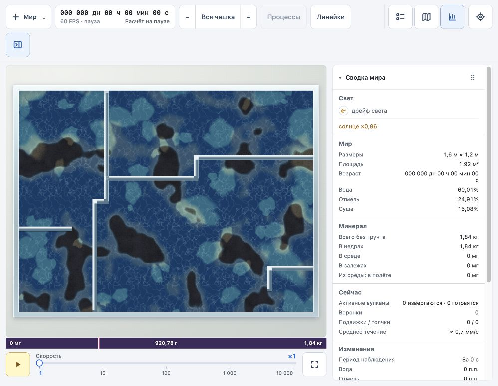
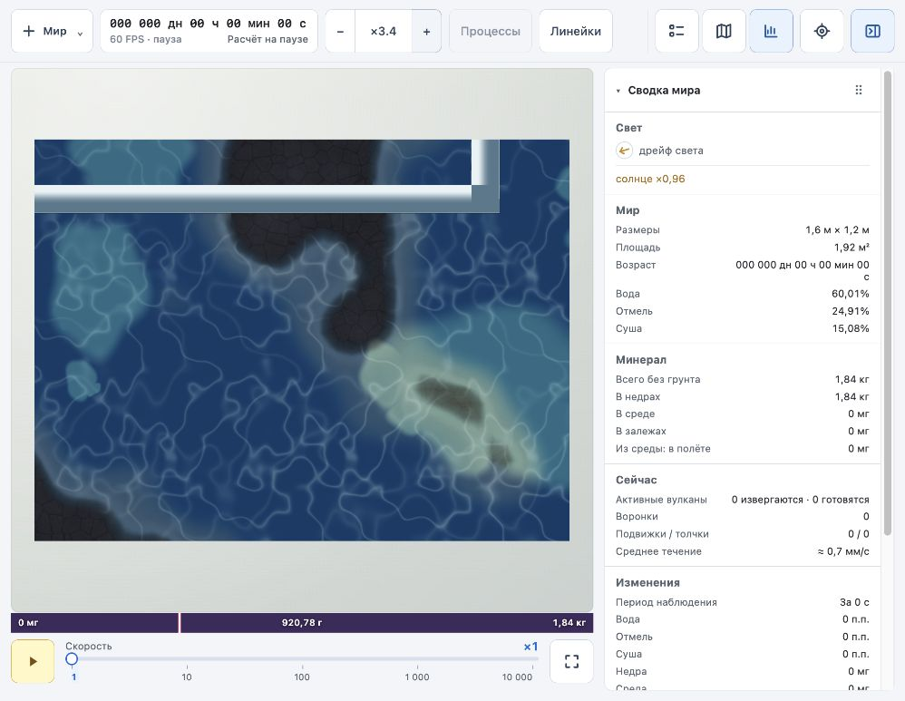
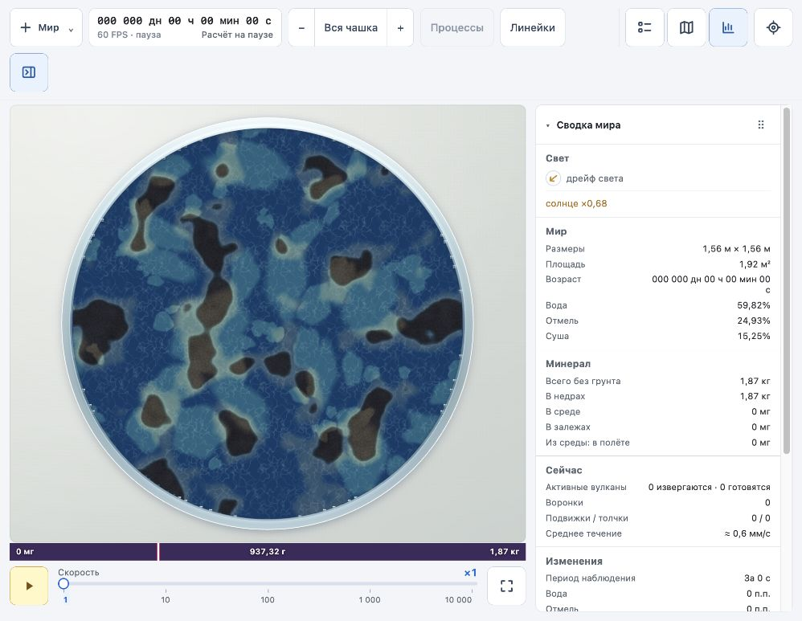
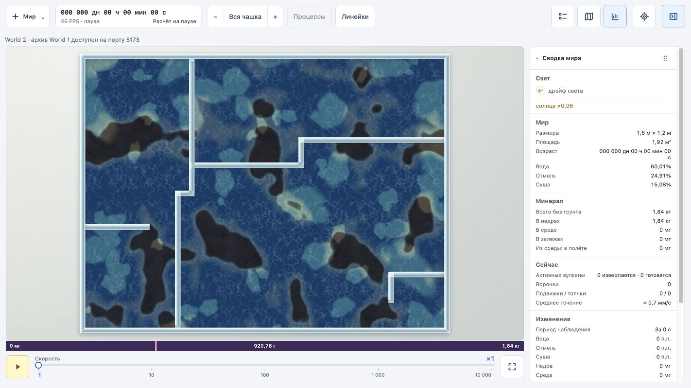

# World 2: стекло, свет и камень

Первый проход улучшения изображения по образцу архивного World 1. Изменения относятся к `world-2`; архив, физическая сетка, столкновения и формат сохранения не менялись.

- Обод чашки получил прежний градиент стекла, светлый край и внешнюю тень. Перегородки получили градиент поперёк полосы, блик и контактную тень; круглая граница отделена от изображения клеточных перегородок.
- Световые пятна рисуются по подготовленным GPU-эллипсам и их пространственному индексу, с плавной границей на уровне экранного пикселя. Физика света использует прежнюю сетку.
- Камень получил пятнистость нескольких масштабов и границы каменных плит. Мелкие детали плавно исчезают, когда становятся меньше пикселя; рисунок закреплён в координатах мира.

Рендер использует существующий индекс пятен и сохраняет лимит восьми storage-буферов. Дополнительных кадровых чтений GPU и увеличения физической сетки нет. Новый материал имеет вычислительную стоимость; сравнительный замер времени кадра в этом проходе не проводился.

## Проверка

`npm --prefix world-2 run build` и `npm --prefix world-2 run check` прошли. В браузере проверены прямоугольная и круглая чашки, перегородки и приближение ×3,4. Ошибок и предупреждений GPU в консоли нет. Проверка сохранения подтвердила JSON, продолжение симуляции и восстановление после потери устройства.

Остаются ограничения: внутренние границы перегородок строятся по клеточной маске; около круглого обода местами заметны мелкие следы дискретной границы. В этом проходе не перерабатывались рябь, частицы и обозначения источников.

## Уточнение стекла

После первого прохода материал перегородок объединён с материалом наружных стенок: общий набор цветов, переходов и белых краёв. Градиент наружной стенки направлен поперёк её толщины, как у перегородок. Изображения выше относятся к первому проходу до этого уточнения. Требование одинакового материала добавлено в `docs/spec/world.md`.

Сборка и компиляция GPU-шейдера прошли; в браузере проверена чашка с перегородками, ошибок в консоли нет.

## Возврат исходного обода

Предыдущая унификация ошибочно изменила внешний обод. Его геометрия, прозрачность и непрерывный вертикальный градиент возвращены к первому проходу. Перегородки используют ту же палитру с прозрачностью и вертикальным распределением цвета; отдельный поперечный градиент убран. Сборка проходит. Изображение `shared-glass.jpg` выше показывает отвергнутый вариант.
