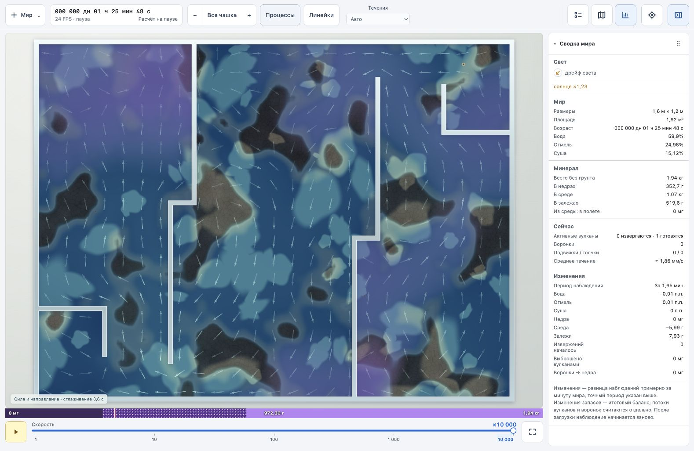
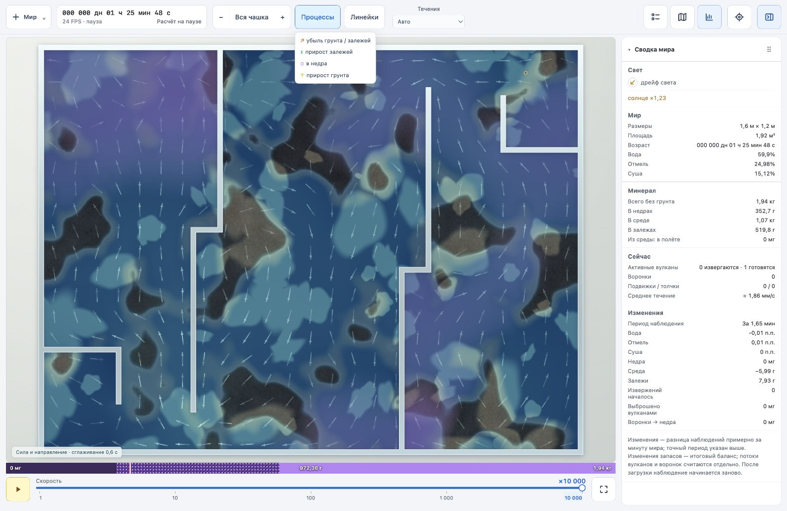

# Течения и физические процессы в World 2

2026-10-03. Физические алгоритмы и шаг 0,1 с сохранены. Доработаны GPU-изображение и управление видом.

## Течения при ускорении

| Скорость просмотра в режиме «Авто» | Показ |
| --- | --- |
| ×1 | Рябь на переносимых физических координатах |
| ×10–100 | Направление поля, сглаживание 0,25 с просмотра; слабая рябь |
| ×1000–10000 | Сила и устойчивое направление, сглаживание 0,6 с просмотра |

Меню «Течения» позволяет выбрать любой режим вручную или скрыть показ. Стрелки берут направление из того же поля, которое переносит вещество; яркость зависит от сглаженной величины скорости. Быстро меняющееся противоположное движение ослабляет стрелку. Их штрихи движутся условно в реальном времени просмотра, поэтому не обозначают пройденное расстояние. Сглаживание обновляется по отображённым кадрам, а не по всем промежуточным физическим шагам: короткие события при большом ускорении могут не попасть в выборку. Пауза останавливает движение и фильтр. Стрелки проверяют геометрию между центром и фрагментом и обрываются у стенок.

Исправлена фаза смешивания двух карт ряби: прежний рисунок обновлялся при максимальном весе, что давало скачок через каждые 20 с мира. Теперь каждая карта обновляется при нулевом весе. Перенос координат остаётся на GPU по физическому полю; визуальное ограничение шага сохраняется для защиты от перескока перегородок.

## Процессы и события

«Процессы» показывает средние итоговые изменения запасов между кадрами, нормированные на прошедшее модельное время и площадь клетки: оранжевый — убыль грунта/залежей, зелёный — прирост залежей, сиреневый — уход в недра, золотой — прирост грунта. Сглаживание — 0,6 с просмотра. Это карта чистых изменений, не раздельное измерение потоков эрозии, оседания и растворения: одновременные встречные обмены могут компенсироваться. При создании или загрузке начальные запасы не считаются приростом.

Жерла получили сглаженную кромку, тёмную сердцевину, цвет подготовки и короткую вспышку нового залпа. Световое кольцо обозначает событие, не физическую волну. После загрузки старые залпы не воспроизводятся как новые. Отверстия воронок получили кромку и условную спираль; их затемнение зависит от силы. Реальные частицы стока сохраняются. Рисуются все активные порции баллистического выброса, вместо первых 70; видимый след ориентируется по направлению порции. На диагностических картах полёт скрыт.

Вспомогательные поля сглаживания и предыдущих запасов остаются на GPU, исключены из сохранения и не участвуют в расчёте физических состояний.

## Проверка связи с солнцем

Добавлена кнопка «Проверить солнце и рябь» в диагностике. Проверка выполняется на полном генерируемом мире, а не только на искусственной сцене:

- При солнце 0 и ещё не активных вулканах/воронках поле скорости равно нулю. Нулевое солнце используется только как контрольная фикстура.
- Неподвижные пятна при солнце 1 создают исходящий поток в светлых зонах и входящий в тёмных; проверяется согласованность дивергенции с источником от контраста света.
- За 16 физических шагов видимая карта ряби смещается обратной трассировкой вдоль того же солнечного поля.
- Солнце 2 даёт скорость ×2,0000 относительно солнца 1; измеренная относительная ошибка 0,0000%.

[Результат на GPU](world-2-processes-2026-10-03/sun-check.txt). Перед диагностическими проверками текущее физическое состояние сохраняется и восстанавливается после завершения.

## Проверки и пределы

`npm --prefix world-2 run build` и `npm --prefix world-2 run check` прошли. Проверены выбор режима, ручные переключения, пауза, независимость фильтра от частоты кадров; прежние проверки генераторов, массы, источников, воронок и панорамирования проходят. На реальном GPU прошли солнечная проверка, сохранение/продолжение двух сцен и восстановление после потери устройства: [результат сохранений](world-2-processes-2026-10-03/save-check.txt).

В браузере проверены общий вид чаши с перегородками, автоматический вид ×10000, переключение режимов и карта изменений. Запрошенная скорость ×10000 остаётся выше производительности физического расчёта на этом устройстве; интерфейс показывает фактический предел. Новый показ делает направление читаемым, но не ускоряет модель.

