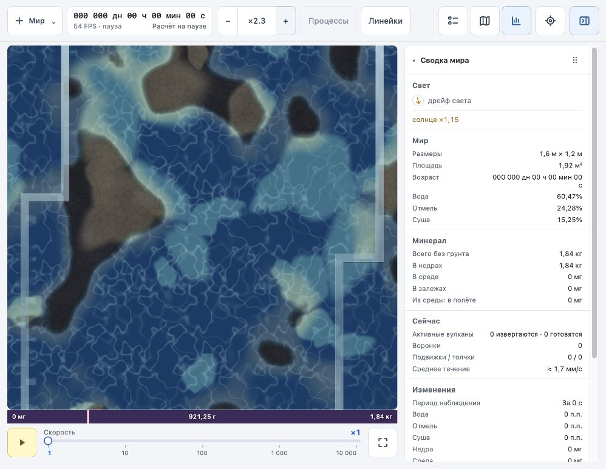
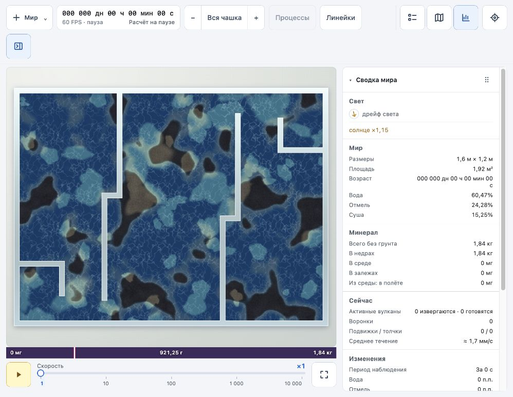
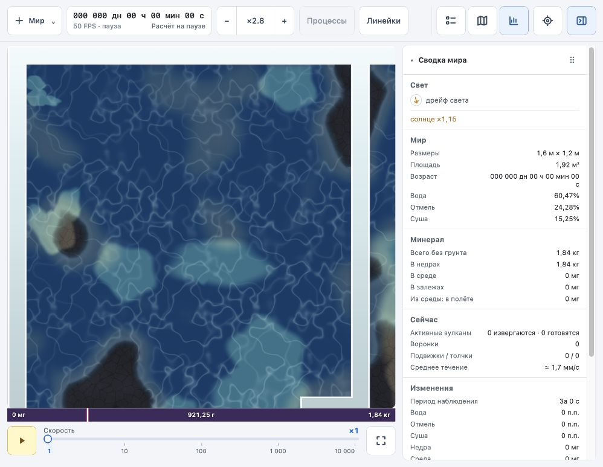

# World 2: перегородки и масштабирование

Причины: изображение перегородок зависело от консервативной сетки столкновений, прозрачность стекла смешивалась с однотонным светлым фоном. Обод скрывался при масштабе больше 1. Обработчик колеса угадывал устройство по величине deltaY, переключая один и тот же жест между панорамированием и зумом. Canvas при увеличении сохранял размеры общего вида, оставляя большие поля.

Перегородки полного мира теперь рисуются как объединение прямоугольных отрезков из исходной планировки, толщиной 16 мм. Граница сглаживается по размеру пикселя. Геометрия передаётся отдельным небольшим uniform-буфером; дополнительных storage-буферов и чтений GPU нет. Лишняя ширина физической клеточной маски заполняется по ближайшей свободной клетке. Стекло смешивается с изображением среды, сохраняя общую палитру с ободом. Расчёт столкновений по прежней консервативной сетке не менялся; физическое разрешение не стало выше.

Обод следует преобразованию камеры и остаётся при приближении. Canvas расширяется до покрытия области карты с сохранением пропорций мира, затем камера продолжает увеличение. Координаты указателя, линейки, точечный маркер и ограничения камеры учитывают это расширение. Колесо всегда увеличивает/уменьшает масштаб вокруг курсора; Shift + прокрутка двигает карту. Размер deltaY нормализуется по deltaMode.

Проверено: `npm --prefix world-2 run build`, `npm --prefix world-2 run check`; GPU-компиляция в браузере без ошибок и предупреждений. В прямоугольном мире на сиде 1497450607 проверены полный вид, кнопки увеличения ×2,25 и ×3,375, увеличение колесом и возврат к полной чашке. Последняя сборка открыта на ×2,25. Проверка всех физических GPU-сцен и отдельный замер производительности в этом проходе не выполнялись.

## Единое изображение стенок и перегородок

По уточнению пользователя внешний обод и перегородки полного мира перенесены в один SVG-слой: общая видимая толщина 10 единиц SVG, светлая кромка 1, общий градиент в координатах чашки, одинаковая подложка и тень. Подложка исключает различие цвета из-за воды под перегородками и нейтрального фона под ободом. Прямоугольные стенки и перегородки объединяются в общий контур; на поворотах и стыках нет повторного наложения материала. Физическая сетка и её толщина не менялись. Основной GPU-вид больше не накладывает собственное изображение перегородок поверх SVG; миникарта сохраняет GPU-представление.

Сборка прошла; в браузере проверены общий вид и ×2,25 на сиде 1497450607, ошибок и предупреждений нет. Открыт общий вид для сравнения толщины.

## Захват карты и внешние стенки при зуме

Захват завершается при отпускании вне карты, потере pointer capture, отмене указателя, потере фокуса, скрытии вкладки, начале прокрутки/масштабирования и Escape. Движение мыши с отпущенной кнопкой сбрасывает оставшийся жест даже без pointerup. Основной указатель изолирован от остальных.

Ограничения камеры включают внешний обод: при сдвиге к краю видно всю толщину стенки и её кромку. SVG построен в постоянных координатах общего вида и трансформируется вместе с миром, поэтому его толщина не меняет коэффициент масштабирования при расширении canvas и не требуется перестраивать контуры на каждый жест колеса.

`npm --prefix world-2 run build` и `npm --prefix world-2 run check` прошли. Новая проверка `scripts/check-pan.mjs` покрывает потерянное отпускание кнопки, отмену захвата, движение без активного жеста, посторонний указатель и достижимость обода при ×1,5–16. В браузере на сиде 1497450607 проверены перетаскивание к верхнему левому краю при ×2,25, отпускание за пределами карты, снятие класса dragging/возврат курсора grab и последующий зум колесом до ×2,8. Ошибок и предупреждений консоли нет. Вкладка оставлена у края чашки с видимыми стенками.

