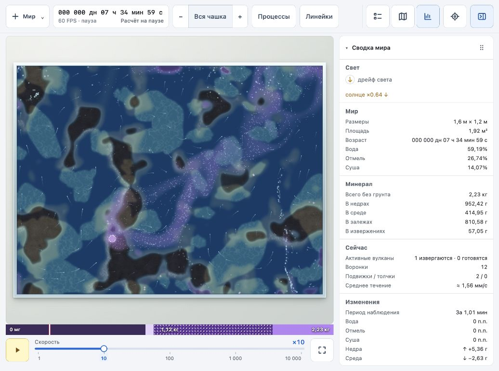
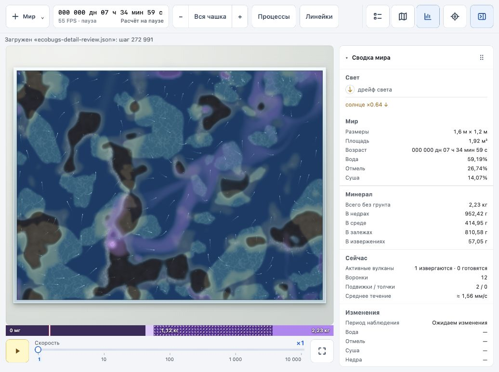
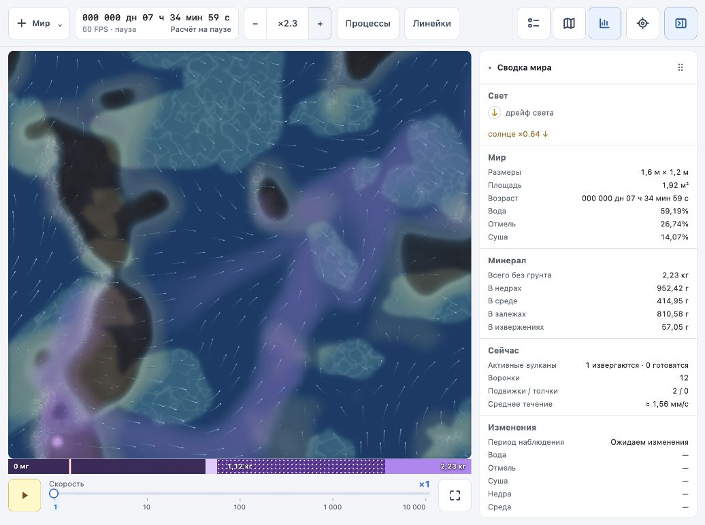
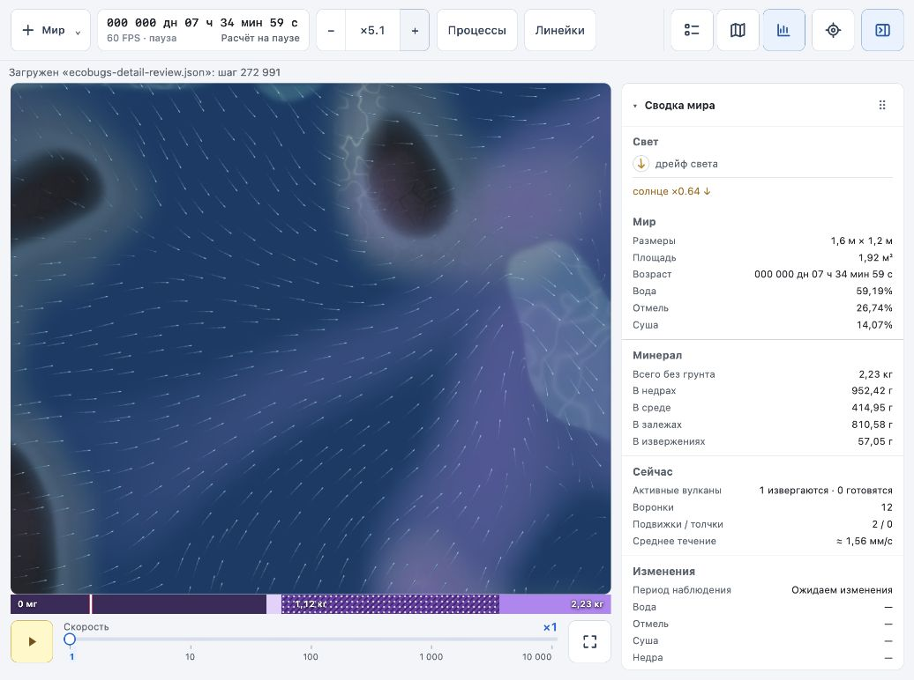
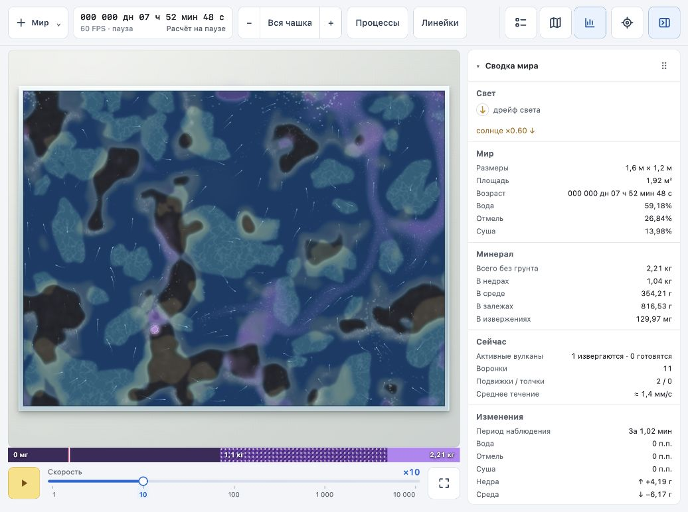

# Четвёртый проход наглядности: детализация по масштабу

2026-10-03. Изменены `world/src/app/render.ts` и документация. Численная модель и формат сохранений не менялись.

## Изменения

- Подложка местности сохраняет крупные пятна камня, воду, берега и цвет залежей. Зерно, трещины, зернистость залежей и мелкие кристаллы усиливаются по разрешению кешированной плитки: от 0 на уровне 0,5 пикселя на мм до 1 на уровне 4 пикселя на мм.
- При зуме верхний готовый уровень плиток накладывается на ближайший готовый более грубый с плавной прозрачностью. Это сглаживает переходы через степени двойки. Размер плитки, предел кеша 240 плиток и бюджет построения 4 мс сохранены.
- Для эффектов используется общий плавный коэффициент от вида всей чашки до ×4, вычисляемый один раз на кадр. На общем плане приглушены зёрна минерала (до 25% яркости), блёстки кристаллов (15%), частицы и следы воронок (50%), частицы притока жерла (55%) и отверстия воронок (60%).
- Жерла, вспышки залпов, дымка минерала и крупные формы остаются заметными. Частицы продолжают движение и старение независимо от яркости; дополнительные частицы, холсты и уровни кеша не добавлены.

## Проверка

- `npm run build` прошёл, включая проверку TypeScript; `git diff --check` без ошибок.
- В браузере просмотрен один и тот же мир с сидом 1 на шаге 272 991: вся чашка, ×2,3 и ×5,1. Возраст и запасы сохраняются при зуме. Для восстановления после обновления страницы использован штатный `simulate.mjs`, хеш 3263805673: недра 952,42 г, среда 414,95 г, залежи 810,58 г, извержение 57,05 г.
- Проверены обратное отдаление, возврат к виду всей чашки и работа на ×10.
- В текущем просмотре на ×10 индикатор показывал 60 FPS; итоговый предпросмотр оставлен на паузе на шаге 283 684.
- Смешиваются готовые уровни. Если при резком приближении нужные плитки ещё не построены, по-прежнему виден более грубый уровень, затем достраиваются участки. Анимация появления отдельных новых плиток не добавлена.
- Отдельный сравнительный замер производительности, круглая чашка и смена DPR в этом проходе не проверены.

## Снимки

