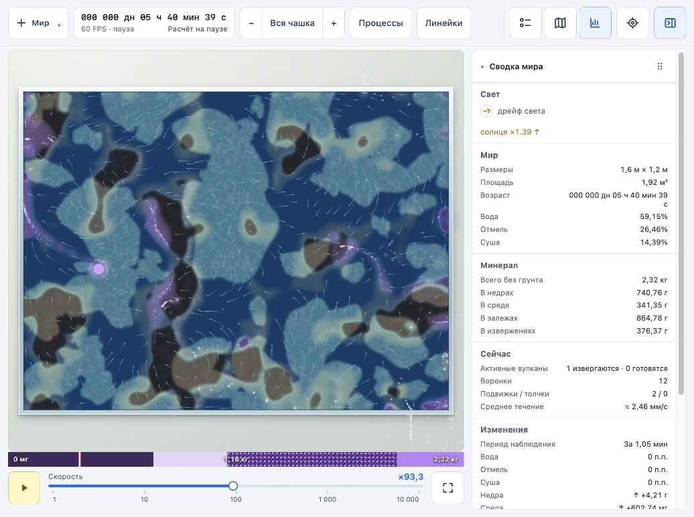
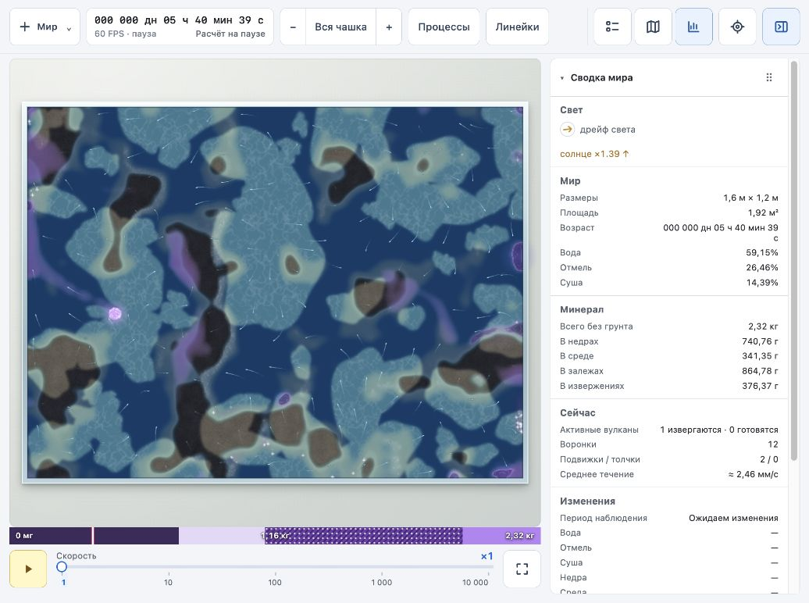
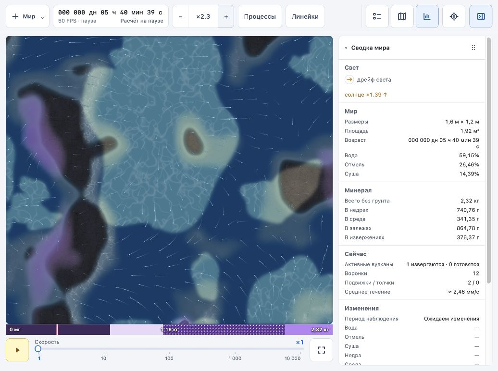

# Второй проход наглядности: течения

2026-10-03. Изменены только показ течений в `world/src/app/render.ts`, пояснение в легенде и документация.

## Что изменилось

- Вместо заполнения вида до 600 меток используется сетка с шагом около 38 CSS px на общем плане и 26 CSS px при приближении ×3. Число кандидатов ограничено 600; клетки вне чашки и на перегородках пропускаются. На небольшом общем виде заметно меньше визуального шума.
- Слабые, средние и сильные потоки имеют три ступени яркости относительно `DRIFT_REFERENCE`. Сила также плавно влияет на условную длину штриха: 10–40 CSS px с ограничением 64 мм.
- Штрихи на отмелях получили тонкую тёмную подложку; на суше они приглушены. Хвост затухает, светлая головка обозначает направление движения.
- При приближении уменьшается шаг построения изгиба с 4 до 2 мм. Сохраняются бюджет построения кривых 1,5 мс и предел 150 перестроений за кадр. Стили группируются по среде и силе потока, без отдельного вызова отрисовки на каждую метку.
- Скорость для оформления читается в текущей точке метки, в том числе после пересева. Перемещение по модельным шагам, ограничения подшагов и частота пересева не менялись.

Модель мира и формат сохранений не изменены. Цвет и длина — условные визуальные признаки; скорость соответствует перемещению метки, а не её длине.

## Проверка

- `npm run build` прошёл, включая проверку TypeScript.
- В браузере проверены общий вид и приближение ×2,3 на прямоугольном мире с сидом 1, шаг 204 390. Для восстановления этого состояния после обновления страницы использован штатный `simulate.mjs`; итоговый хеш 4046092216. Массы совпали с показанными до обновления: недра 740,76 г, среда 341,35 г, залежи 864,78 г, извержение 376,37 г.
- Проверены пауза, запуск на ×10 и переключение процессов. Ошибок и предупреждений в консоли при просмотре не было.
- Отдельный сравнительный замер стоимости отрисовки не выполнен. Круглая чашка, другие сиды и проходы между перегородками в этом просмотре не проверены.

## Снимки

До и после показано одно физическое состояние; расположение трассеров после загрузки пересеивается, а сводка изменений начинает наблюдение заново.

