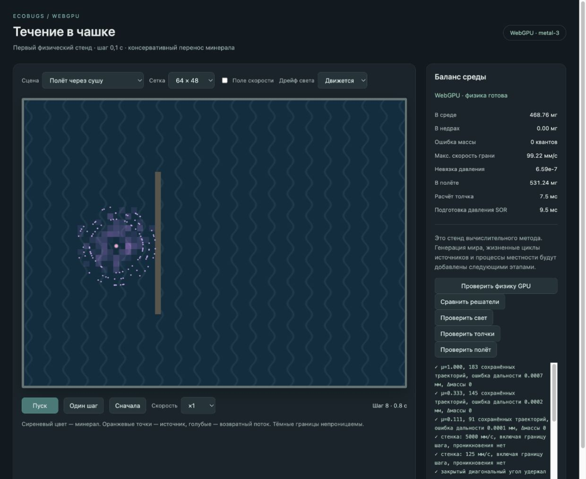

# GPU-мир: баллистический полёт минерала

Дата: 2026-10-03. Этап после затухающего поля толчков (`17f4eee`). Реализован и проверяется в отдельном `world-gpu`; старый `world` не менялся.

## Реализация

Порции минерала имеют реальную целочисленную массу, положение, направление, скорость и остаток дальности. GPU выдаёт их из резерва жерла, двигает с собственной скоростью плюс общей скоростью среды, а после остановки возвращает массу в поверхностное поле. Четвёртое слово состояния ячейки учитывает массу в полёте у исходного жерла. Сводка включает её; независимая проверка сравнивает этот учёт с суммой масс живых порций.

Бюджет дальности расходуется на каждый пройденный миллиметр: вода 1, отмель 3, суша 9. Трассировка пересекаемых клеток останавливает порцию перед стенкой, закрытым диагональным углом или при входе в отверстие. На острове часть траекторий заканчивается у ближней стороны, часть проходит насквозь. После приземления работает обычный консервативный перенос; отверстие запрещает выход и поглощает только избыток.

Направления и различные дальности определяются сидом и порядковым номером порции. Распределение дальностей смещено к жерлу. Все порции считаются на GPU. Отдельный инстансный проход рисует непосредственно их позиции; для кадра массив не читается на CPU. Пул — 1024 места по 48 байт, максимум 64 новых порции за шаг. Дополнительные проходы: выдача, полёт, сбор приземлений. При заполнении пула невыданная масса остаётся в резерве и выходит после освобождения мест.

Добавлены сцены «Залп: полёт», «Полёт и стенка», «Полёт через сушу», «Полёт и отверстие», «Свет + полёт + воронка» и кнопка «Проверить полёт».

## Проверки

Реальный браузерный WebGPU, устройство `metal-3`. [Результаты полёта](world-gpu-flight-2026-10-03/flight-checks.txt):

- В однородной воде, отмели и суше конечная дальность совпала с независимой аналитической формулой: максимальная ошибка менее 0,001 мм. Пул переиспользует завершившиеся места, поэтому итоговый снимок содержит последние траектории, а не полный журнал выброса.
- Стенка при 5000 мм/с и при точном попадании на границу шага при 125 мм/с; закрытый диагональный угол. Проникновения нет.
- Прямой полёт через полосу суши: 88 сохранённых траекторий завершились до неё, 78 на ней, 17 за ней. Совпадение с кусочной аналитической формулой лучше 0,001 мм.
- Отверстие остановило 95 сохранённых траекторий. Пул всего из 8 порций выдал весь резерв и завершил полёт без потерь.
- Совместные свет, толчок и полёт: 200 шагов, повтор с другой разбивкой на пакеты побитово совпал для масс, поля скорости и порций.
- Сетки 64×48 и 128×96: точный баланс и изоляция закрытых отсеков во время и после полёта. Во всех тестах учёт массы в полёте совпал с фактическими порциями и GPU-сводкой.

[Повторные проверки переноса](world-gpu-flight-2026-10-03/physics-checks.txt) включают 100 000 шагов с нулевой ошибкой массы и утечками. [Проверки света](world-gpu-flight-2026-10-03/light-checks.txt) и [толчков](world-gpu-flight-2026-10-03/vent-checks.txt) также прошли. Последние строки старых проверок отражают прежний этап; баллистика проверена отдельным набором выше. Сборка TypeScript/Vite и Node-проверки 60 начальных сцен прошли.

Визуально проверена сцена «Полёт через сушу» на шаге 8 (0,8 с), сетка 64×48, скорость ×1: 468,76 мг в среде и 531,24 мг в полёте, ошибка 0 квантов. Частицы видны вокруг жерла, приземлившийся минерал отображается поверхностным полем; повторные одиночные шаги дали ожидаемый счётчик. Ошибок и предупреждений браузера нет.

## Границы этапа

Это контролируемый короткий залп из одного активного жерла. Подготовка извержения, серия 1–4 затухающих залпов, истечение, связь силы с дальностью, давление и общий резервуар недр ещё впереди. В старых контрольных сценах толчков жерло по-прежнему выдаёт массу локально для независимой проверки поля.

Фиксированный шаг — 0,1 с. Новая порция получает полный шаг движения сразу при выдаче; точное время рождения внутри шага пока не интегрируется. Поле среды обновляется раз в модельную секунду. Для экстремальной скорости трассировка ограничена 64 пересечениями за шаг: при превышении порция приземляется в последней допустимой клетке, сохраняя массу. Это инженерное ограничение стенда, не правило спецификации. Общая дальность сейчас фиксирована параметром сцены, а не силой каждого залпа.

Разрешение, число порций и скорость предстоит сопоставить по качеству и стоимости в полном мире. Ускорение полного мира этим этапом не доказано. Генерация, процессы местности, жизненные циклы источников и сохранения не завершены. Следующий этап — автомат источников и общие недра.
