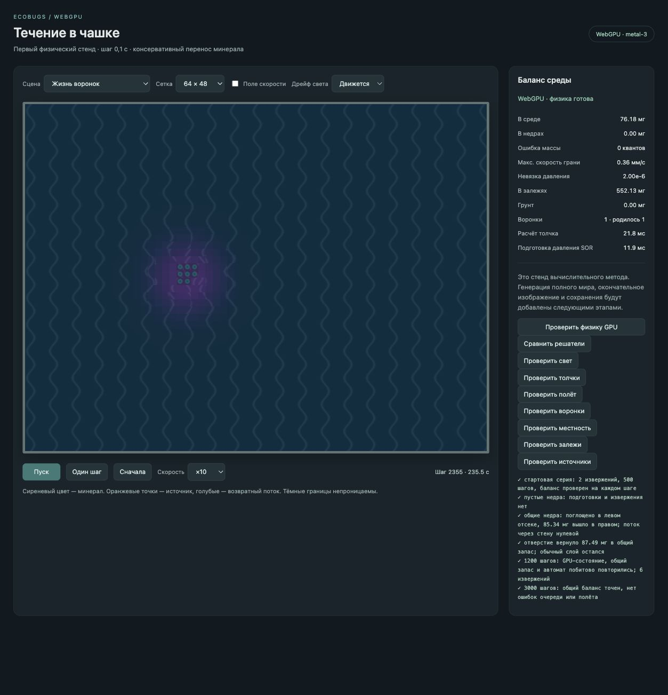

# GPU-мир: воронки и расположение вулканов

2026-10-03. Предыдущий этап местности — `9c04ae1`.

## Автоматы

Воронка рождается у связного скопления залежей: граница — 1,5 средней плотности опорного запаса, ядро — 6 средних плотностей, минимальная площадь 1920 мм². На скопление и полосу 80 мм вокруг допускается одна воронка; пересекающиеся ареолы не создают дополнительные отверстия. Отверстие занимает округлённую вверх десятую часть клеток скопления, строится связным от самой густой клетки, затем не перемещается и не меняет форму.

Сила растёт или убывает с фиксированной частотой проверки, характерное время 60 тысяч шагов. Пока в ареоле есть плотное ядро, воронка усиливается; когда ядро исчезло — тает. Возвращение густого ядра разворачивает угасание без создания нового отверстия. После полного угасания отверстие удаляется. В контрольной сцене рост ускорен до 3000 шагов, проверка идёт каждые 100; нормальная проверка каждые 1000 шагов. Нулевая скорость местности выключает автомат и обмены.

Сила управляет тягой и подъёмом сверхплотных залежей в растворённое поле. В отверстии остаётся обычный слой: только превышение 1,5 средней плотности уходит в общие недра. Односторонняя геометрия действует уже при нулевой начальной силе отверстия. При исчезновении геометрия возвращается к обычной среде. Тяга входит в тот же затухающий решатель, который используется вулканами; другие процессы и изображение используют суммарную скорость.

Для поиска связности редко читается только карта грунта и залежей, без давления, частиц, света и скорости. Это предусмотренный планом вариант CPU-поиска связности, не чтение полного мира для кадра. События выбираются строго на фиксированном шаге, чтение завершается до продолжения физики. Массы и обмены остаются на GPU. CPU- и GPU-поиск связности ещё предстоит сравнить на полном мире.

Новые вулканы выбирают свободные места с весами по удалённости от залежей: около скопления вес мал, но ненулевой, вдали увеличивается до обычного. Отверстия исключены. Расстояние считается под дном, не ограничено перегородками. Спящие вулканы сохраняют свои места. Последняя прочитанная карта используется в промежутке до следующего фиксированного обновления.

Добавлены сцены «Жизнь воронок» и «Цикл минерала». Во второй совместно включены свет, вулканы, залежи, изменение сопротивления, воронки и нормальное расписание подвижек. Начального контрольного отверстия там нет. Это всё ещё управляемая геометрия с запасом 5 г, а не полный генератор из спецификации.

## Проверки

Node-проверка: связное скопление, десятую часть отверстия, исключение повторного рождения в ареоле, рост, угасание, возврат к росту, удаление и веса новых жерл. Геологические события повторяются для нескольких сидов.

GPU-проверка отдельно задаёт избыток растворённого минерала в отверстии: раннее отсутствие возврата из одних только залежей не считается ошибкой, пока там ещё не накоплен обычный слой. Проверяется возврат только избытка, постоянство отверстия, точный баланс и повтор с пакетами 16 / 5. Пустое ядро вызывает угасание и удаление отверстия. Общий цикл света, вулканов и минерала проверяется совместно.

Реальный GPU `metal-3`: [проверки воронок](world-gpu-funnels-2026-10-03/funnel-checks.txt) и [повторные проверки вулканов](world-gpu-funnels-2026-10-03/source-checks.txt) прошли. Из контролируемого избытка в отверстии 14,130 мг вернулось в недра, обычный слой остался. Совместные 2000 шагов повторились с пакетами 16 / 5. Сборка и Node-проверки 87 сцен прошли.

В ручном запуске естественная воронка родилась, а к шагу 10000 угасла после исчезновения ядра; ошибка массы 0. Повторный запуск оставлен на шаге 2355 с одной растущей воронкой: в среде 76,18 мг, в залежях 552,13 мг, ошибка массы 0. Снимок показывает физическое отверстие и искажение ряби, художественное оформление ещё впереди.

Следующий этап — полный генератор, физический масштаб запасов и грунта, световые пятна и параметры создания. Производительность чтения карты, поиска скоплений и динамического давления пока не измерена на полном мире.
