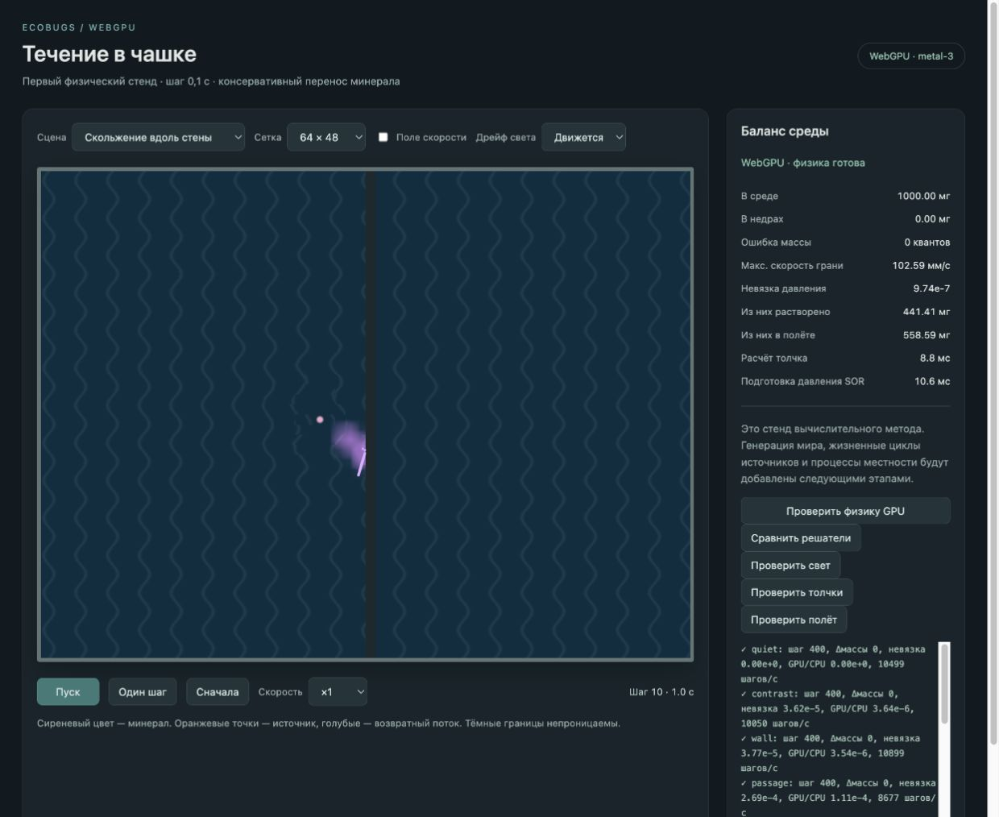

# GPU-мир: затухание, отскок, скольжение и смешивание

Дата: 2026-10-03. Предыдущий этап полёта, уточнение спецификации и ближайший план зафиксированы коммитом `85639f6`. Этот проход реализует раздел «Движение выброшенного вещества» в `world-gpu`.

## Поведение и метод

Собственная скорость порции теперь плавно убывает вместе с запасом движения. В однородной среде без течения ускорение торможения равно `v² / (2 R μ)`, где `R` — оставшаяся дальность в воде, `μ` — подвижность 1 / ⅓ / ⅑. Дальность расходуется собственным перемещением относительно среды; общая скорость течения добавляет снос. При смене материала ускорение пересчитывается, скорость остаётся непрерывной. Вода / отмель / суша дают прежние конечные дальности 1 / ⅓ / ⅑.

При контакте со стеной собственная поперечная скорость отражается с коэффициентом 0,15, продольная сохраняет направление с коэффициентом 0,75. Остаток запаса движения умножается на отношение квадратов скоростей после и до удара. Это уменьшает собственный импульс и доступную дальность, сохраняя массу. Угловое столкновение обрабатывает обе нормали. После контакта используется оставшееся время шага; источник не выдаёт новый импульс отскочившей порции. Нормальное течение у закрытой грани ограничивается, поэтому оно не толкает порцию сквозь стену.

Внутренние временные отрезки не длиннее 0,01 с; время первого контакта вычисляется из уравнения движения с торможением, включая возможную смену знака компоненты скорости при противодействующем течении. Физический внешний шаг остаётся 0,1 с. Порог завершения собственного движения — 0,5 мм/с, либо остаток дальности 0,0001 мм. Максимум 256 событий на порцию за шаг. Если их не хватает, GPU отмечает незавершённую интеграцию и сводка останавливает стенд с сообщением; тихого приземления или укороченного успешного шага нет. Во всех контрольных сценах предел не достигнут.

При смешивании вся масса распределяется компактным гладким ядром радиусом 35 мм. Радиус задан в физических единицах, не в клетках. Вес — квадрат `max(0, 1 − r²)`, где `r` — расстояние от центра порции, делённое на радиус. Видимость клеток ядра проверяется трассировкой: оно не переносит массу за стену, через закрытый угол или край отверстия. Попавшая в отверстие порция смешивается только внутри отверстия. Целочисленные доли распределяются в фиксированном порядке по накопленному весу; остаток остаётся в исходной свободной клетке. Сумма квантов точна.

Направления и дальности используют последовательности с малым расхождением и сдвигом от сида, чтобы уточнение числа порций меньше меняло форму выброса. Порция занимает 64 байта, включая диагностику последнего удара; пул из 1024 мест — 64 КиБ. Для обычного кадра массив остаётся на GPU. Отображение растворённой плотности интерполирует физическое поле с учётом стен, углов и отверстий; физическую массу оно не меняет. «В среде» теперь включает растворённое вещество и полёт, обе части показаны отдельно — в соответствии с уточнённым балансом спецификации.

Добавлены сцены «Прямой удар о стену» и «Скольжение вдоль стены».

## Числовые проверки

Браузерный WebGPU, `metal-3`. Полный [протокол полёта и столкновений](world-gpu-impact-2026-10-03/flight-checks.txt):

- Конечная дальность по трём материалам и через полосу суши совпала с независимыми аналитическими формулами с ошибкой менее 0,06 мм. Скорость торможения — с ошибкой 0,0001 мм/с.
- Прямой удар дал отношение скоростей 0,1500, косой при направлении `(1; 0,5)` — 0,3612. Это соответствует раздельной потере поперечной и продольной компонент. Направление скольжения сохранено. Масса и реальные живые порции проверены на каждом из 30 шагов обеих сцен.
- Закрытые стены, угол, отверстие, малый пул из 8 мест и повтор с другой разбивкой на пакеты прошли. Собственное движение в углу завершилось без дрожания. Во время и после полёта GPU-учёт равен сумме живых масс.
- У открытого прохода скольжение и постоянное течение перенесли 999,68 мг на другую сторону за 200 шагов. Отдельная сцена с тонкой стеной и далёким проходом проверила, что сглаживание не перескакивает через закрытую часть внутри одной связной области.
- Сетки 64×48 / 128×96 / 256×192: центры пятна `(0,59; 0,49)` / `(0,54; 0,46)` / `(0,55; 0,47)` мм относительно жерла; RMS-радиусы 230,24 / 230,18 / 230,18 мм. Допуск проверки — 5 мм по центру и 5% по радиусу; фактические различия существенно меньше.
- 32 / 64 / 128 новых порций за шаг: RMS-радиусы 228,67 / 230,18 / 227,98 мм. Максимальное отличие от старшей выборки менее 1% по радиусу и 5,6 мм по центру; допуски — 5% и 15 мм. Это сходимость распределения, а не побитовое совпадение разных дискретизаций.
- Один контрольный замер без изображения: 60 шагов на 128×96 за 37,1 мс. Он включает ожидание GPU и отправку, но исключает подготовку полей. Это не сравнительный аудит производительности и не доказательство выигрыша полного мира.

Во всех сценах ошибка массы — ноль. Сборка TypeScript/Vite, 66 начальных сцен в Node и интегральная выдача короткого залпа проверены.

[Повторный прогон общего переноса](world-gpu-impact-2026-10-03/physics-checks.txt) прошёл, включая 100 000 шагов с нулевыми потерями и утечками. Совместная работа со светом проверена в наборе полёта; отдельные прежние проверки света и толчков в этом проходе не повторялись, их алгоритмы не менялись.

В браузере проверена сцена «Скольжение вдоль стены», 64×48, шаг 10 (1,0 с): 1000 мг в среде, из них 441,41 мг растворено и 558,59 мг ещё движется по инерции; ошибка массы ноль. Видны поворот и вытягивание выброса у стены и плавное пятно смешивания. Запуск, пауза и одиночный шаг проверены: на паузе шаг 72, одиночный шаг дал 73. После сброса сцена оставлена на шаге 10. В консоли браузера ошибок и предупреждений нет.

## Осталось

Коэффициенты закреплены для этой версии стенда; дальнейшая калибровка требует повторных контрольных сцен. Визуальный рисунок частиц пока простой, не изображение полноценного извержения. Измеренные моменты проверяют масштаб и центр пятна, но не заменяют оценку локального размывания и полного распределения.

Генератор местности и света, общий резервуар недр, давление и автомат вулканов, затухающая серия залпов и истечение, жизненные циклы воронок, диффузия растворённого минерала, залежи, эрозия и сохранения ещё впереди. Смешивание порций реализовано; общее растекание растворённого поля между шагами будет добавлено в этапе процессов минерала. Следующий этап — автомат источников и общие недра, включая связь мощности залпа с дальностью.
