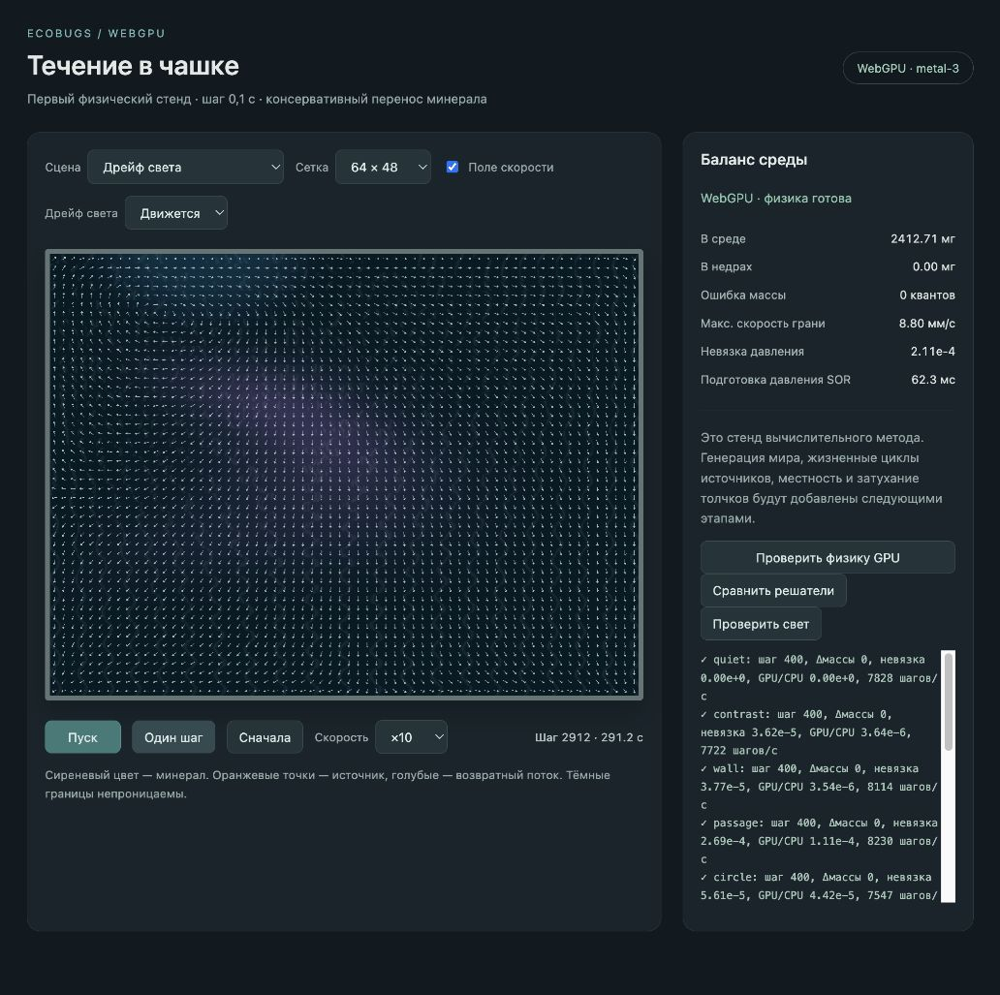

# Динамический свет и проекция увлечения

2026-10-03. Предыдущий этап — ускорение статического давления — зафиксирован в `7fdaad9`. Этот проход добавляет световые сцены в `world-gpu`, не меняя старый `world`.

## Что реализовано

Карта света рассчитывается WGSL-проходом на GPU. Три гладких пятна фиксированной тестовой карты дрейфуют и деформируются; карта имеет период 2 ширины/высоты чашки и больше её видимой области. Пятна объединяются максимумом, не сложением яркости. Фон равен 0,12 яркости пятна, солнце меняется плавно с размахом 0,2. Генератор карты и фазы по сиду ещё не подключён.

Средняя освещённость рассчитывается отдельно для каждой связной области. Контрастный источник — разница местного и среднего света, умноженная на коэффициент сцены. Дрейф задаёт предварительное увлечение на открытых гранях с проводимостью среды. Давление решает задачу с правой частью «контраст − дивергенция увлечения». Итоговая скорость — предварительное увлечение плюс поправка давления: дивергенция соответствует контрастным источникам, стены не пропускают поток, увлечённая среда возвращается внутри чашки. Изображение и перенос минерала используют эту общую скорость.

Крупные поля света, средние по отсекам, правая часть, давление и скорости остаются на GPU. CPU передаёт только небольшие параметры света и модельное время. Обычная сводка читает редуцированные величины; полный снимок светового поля доступен для проверки. Минерал не участвует в физическом расчёте света/течения.

Поле обновляется перед транспортными шагами 0, 10, 20…: раз в одну модельную секунду. В промежутке используется одно поле; изображение не двигает карту самостоятельно. Нулевой дрейф отключает увлечение, контрастное течение сохраняется. На паузе свет, поле и массы стоят. Пересчёт не меняет шаг 0,1 с и не зависит от FPS или скорости приложения.

Для световых сцен SOR использует коэффициент 1,6 и `max(256, cols²/2)` циклов с нулевого давления. Для прежних статических сцен параметры остались прежними. Последовательное суммирование света в Float32 не прошло проверку баланса на больших сетках; заменено явным деревом суммирования через 128 частичных накопителей. Это прототип редукции по нескольким отсекам: один GPU-поток обрабатывает каждый отсек. При большом количестве областей потребуется масштабируемая групповая редукция.

Интерфейс получил сцены «Дрейф света» и «Свет в закрытых отсеках», переключатель «Движется / Стоит» и кнопку «Проверить свет». Переключение сцены, сброс, проверки и одиночный шаг ждут текущую ограниченную серию транспортных шагов перед изменением буферов. Пауза останавливает выдачу дальнейших шагов; уже начатое обновление завершается.

## Проверки

Реальный WebGPU `metal-3` во встроенном браузере. [Точный вывод](world-gpu-light-2026-10-03/light-checks.txt):

- При нулевом дрейфе предварительное увлечение равно нулю, контрастный поток ненулевой.
- Солнце ×2 усиливает скорость ×2 в пределах численного допуска; изменение распределения минерала не меняет физические свет и скорость.
- При отключённом контрасте проекция сохраняет ненулевое увлечение с возвратом, максимальная абсолютная дивергенция — 4,36·10⁻⁶ клеток/с.
- Динамические сцены со стенкой и без неё: 200 шагов, баланс массы и отсеков, непроницаемые грани, баланс световых источников, отсутствие NaN. Свет и скорость изменяются во времени.
- Повтор 200 шагов с другим разбиением на пакеты даёт те же массы, поля света и скорости на этом устройстве.
- Относительная невязка: 1,31·10⁻⁴ на 32×24, 2,00·10⁻⁵ в закрытых отсеках 32×24; 2,27·10⁻⁴ на 64×48 и 7,43·10⁻⁴ на 128×96. Порог проверки — 10⁻³. Сводка совпадает с диагностикой полного снимка.

Сборка TypeScript/Vite и проверка 30 начальных сцен/сеток проходят. Старые восемь физических сцен повторно прошли GPU-аудит, включая 100 000 шагов без дрейфа массы или утечки. [Вывод регрессии](world-gpu-light-2026-10-03/physics-checks.txt).

В интерфейсе просмотрено движение на ×10 до шага 2911. На паузе счётчик не меняется; одиночный шаг даёт 2911 → 2912. Ошибок и предупреждений браузера нет. Предпросмотр оставлен на световой сцене 64×48 с полем скорости.

## Что остаётся

Это этап световой физики, не завершённая реализация спецификации. Доли освещённости, размеры пятен, параметры дрейфа и сид ещё не управляют полным генератором. Температура, усвоение света и визуальная прозрачность минерала также впереди. Нет окончательного оформления местности и ряби.

Динамическая проекция требует больше работы, чем статическое давление: стоимость обновления на больших сетках и влияние на паузу нуждаются в отдельном измерении. Интерфейсное время расчёта давления не включает создание светового поля. Ускорение статического решателя 16–22× из прошлого отчёта не переносится автоматически на этот этап. Проверки охватывают короткую динамику одного устройства; длительный динамический и межустройственный аудит ещё не выполнены.

Следующий физический этап — отдельная затухающая задача вулканов и воронок с трением, затем суммирование её скорости с солнечной. Ручные пары источника/возврата в старых тестовых сценах пока остаются контрольными примерами; они не выданы за полные жизненные циклы источников.

