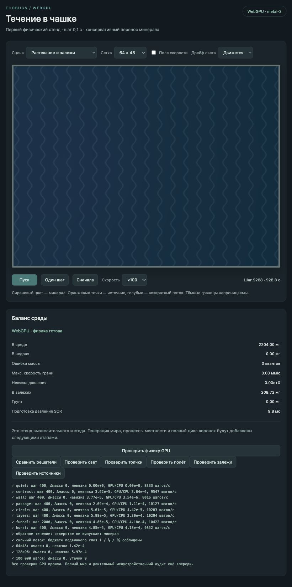

# GPU-мир: растекание, стекание и залежи

2026-10-03. Общие недра и вулканы зафиксированы в `587449f`. Следующий этап добавляет процессы минерала в `world-gpu`; прежний `world` не изменён.

## Реализация

Грунт и залежи имеют отдельный GPU-буфер целых квантов 0,001 мг. Диагностика и сводка включают обе категории; кадр читает буфер непосредственно на GPU. Оседание и растворение обмениваются с растворённым полем без создания или компенсационной потери массы.

Растекание действует от большей плотности к меньшей через четыре грани, с гармонической проводимостью соседних клеток. Стекание использует уклон поверхности: грунт + залежи + растворённый минерал. За проход ограничен суммарный исходящий объём до половины массы клетки. Получатель собирает те же целочисленные передачи, которые списаны у отправителя; дробные остатки хранятся отдельно. При исчезновении или развороте градиента остаток не толкает вещество в обратную сторону. Стенки непроницаемы. Отверстие принимает входящие передачи, но не выпускает минерал.

Оседание замедляется при большой скорости общего течения и усиливается при его схождении. Грунт и залежи вместе не могут от оседания подняться выше верха отмели. Верх задаётся целым количеством квантов: расчёт порога через Float32 первоначально дал ошибку на один квант, исправлен до включения процесса в сцены вулканов. Растворение залежей медленное, возвращает вещество в среду. Каждый процесс имеет независимый коэффициент; нулевой коэффициент выключает соответствующий процесс.

Для текущего стенда коэффициенты: диффузия 100 мм²/с, стекание 100 мм²/с с нормировкой уклона на плотность 0,02 мг/мм², оседание 0,0001/с, растворение 0,00005/с. Последнее даёт характерное время 200 тысяч шагов. Верх отмели пока соответствует 0,02 мг/мм². Это калибровка контролируемых сцен; полный генератор и масштаб грунта ещё предстоит согласовать. Размыв, выветривание, подвижки и пересчёт сопротивления по уровню относятся к следующему проходу.

Процессы включены в новую сцену «Растекание и залежи» и в обе сцены автоматических вулканов. Независимые старые контрольные сцены сохраняют свой набор процессов. Добавлена кнопка «Проверить залежи».

## Проверки

Реальный WebGPU `metal-3`: густое пятно расползается, ровный фон неподвижен, стенка и одностороннее отверстие соблюдаются. Перенос первого шага на воде / отмели / суше — 16000 / 5332 / 1776 квантов, соответствует отношению 1 : ⅓ : ⅑ с целочисленным округлением. Стекание учитывает грунт, не переносит сам грунт. Оседание точно достигает верхнего предела; растворение вернуло 2,438 мг из 50 мг за 10 тысяч шагов. Сетки 64×48 и 128×96 сохраняют массу при совместном действии процессов. Разбивка на пакеты 16 и 5 шагов не меняет результат.

Протоколы: [минерал](world-gpu-mineral-2026-10-03/mineral-checks.txt), [источники с залежами](world-gpu-mineral-2026-10-03/source-checks.txt), [прежние физические сцены и 100 000 шагов](world-gpu-mineral-2026-10-03/physics-checks.txt). Все проверки прошли с точным балансом. Ручной запуск ×100 остановлен на шаге 9288: в среде 2204,00 мг, в залежях 208,72 мг, ошибка массы 0 квантов; пауза работает. Сборка и Node-проверки 75 сцен прошли.

