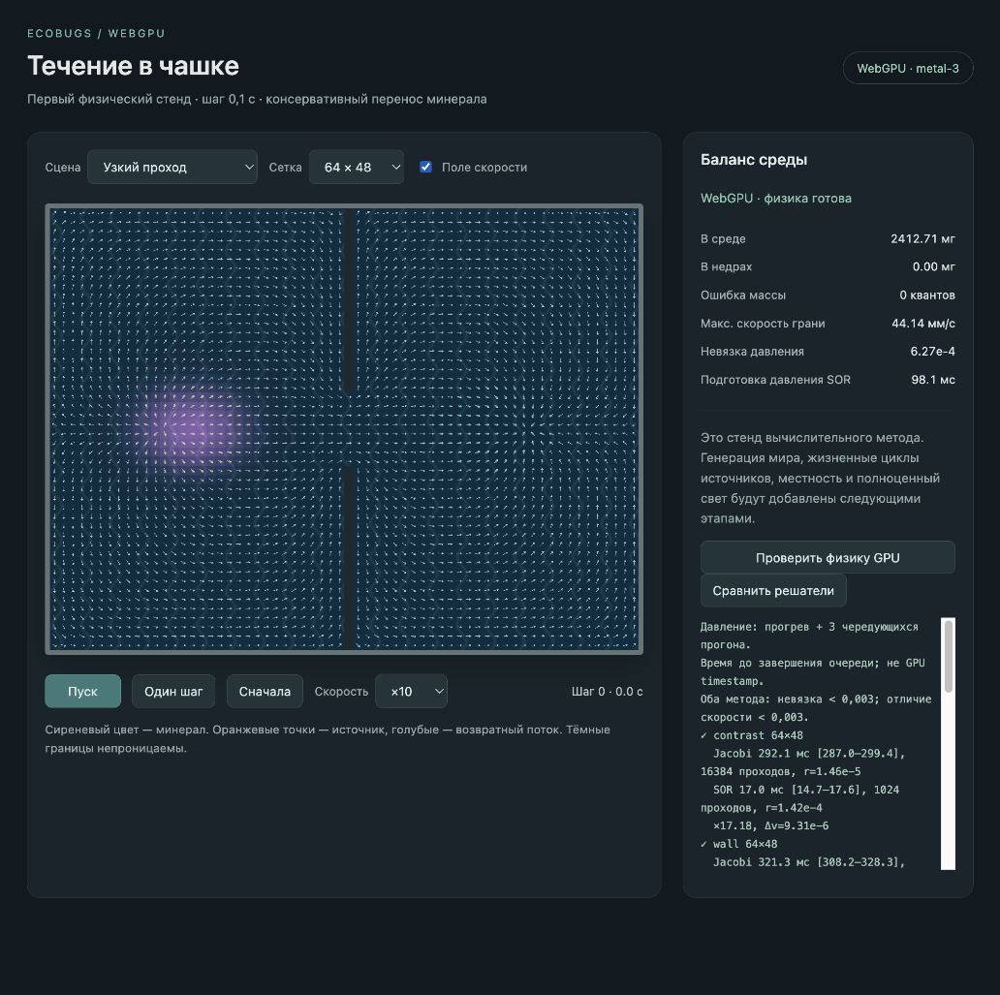

# Ускорение давления GPU

2026-10-03. Исходный физический стенд закоммичен в `5cb0475`. Следующий проход меняет численный решатель в `world-gpu`, сохраняя уравнение, проводимости граней и консервативный перенос. Старый `world` не менялся.

## Реализация

Основной решатель — red-black SOR, коэффициент релаксации 1,95. Красные и чёрные клетки обновляются отдельными GPU-проходами: внутри цвета нет зависимостей между соседними записями; отдельные проходы обеспечивают порядок между цветами. Число итераций фиксировано по сцене и размеру, не зависит от FPS или ускорения времени: обычные сцены `max(256, cols²/8)`, узкий проход `cols²`. Каждый цикл состоит из двух проходов. В контролируемых сценах число столбцов кратно 32.

Jacobi сохранён для измерительного сравнения. Он не является запасным движком приложения. Оба решателя стартуют с нулевого давления. Время включает очистку, подготовку и отправку команд, ожидание завершения очереди и расчёт скорости; исключает создание конвейеров и чтение результата. Это время на стороне приложения, не GPU timestamp.

Сравнение с независимым CPU-решателем учитывает произвольную аддитивную константу давления отдельно в каждой замкнутой области. Скорости сравниваются непосредственно. Кнопка «Сравнить решатели» выполняет прогрев и три прогона с чередованием порядка. Принятый порог относительной невязки и относительного L2-различия скоростей — 0,003.

## Измерения

Встроенный браузер, WebGPU `metal-3`. Медиана трёх прогонов:

| Сцена | Сетка | Jacobi, мс | SOR, мс | Ускорение | Невязка SOR | Отличие скоростей L2 |
| --- | --- | ---: | ---: | ---: | ---: | ---: |
| Свет → тень | 64×48 | 292,1 | 17,0 | 17,18× | 1,42·10⁻⁴ | 9,31·10⁻⁶ |
| Закрытые отсеки | 64×48 | 321,3 | 15,1 | 21,28× | 1,39·10⁻⁴ | 9,63·10⁻⁶ |
| Круг | 64×64 | 286,8 | 17,3 | 16,58× | 2,22·10⁻⁴ | 2,70·10⁻⁵ |
| Вода / отмель / суша | 64×48 | 291,1 | 15,5 | 18,78× | 1,37·10⁻⁴ | 5,87·10⁻⁵ |
| Узкий проход | 64×48 | 2552,8 | 149,0 | 17,13× | 6,27·10⁻⁴ | 9,17·10⁻⁵ |
| Свет → тень | 128×96 | 1916,3 | 86,2 | 22,23× | 5,97·10⁻⁴ | 2,25·10⁻⁵ |

SOR делает в 16 раз меньше вычислительных проходов. Невязки Jacobi ниже (1,32·10⁻⁵–6,96·10⁻⁵); сравнение проходит общий допуск, но не означает равные невязки. Диапазоны времени каждого прогона и точные значения сохранены в [comparison.txt](world-gpu-pressure-2026-10-03/comparison.txt).

## Проверки и границы результата

Повторно пройдены восемь физических сцен, CPU-сопоставление давления, баланс по отсекам, отсутствие NaN/утечек, расход через узкий проход, запрет выхода из воронки, бюджеты слоёв, повтор запуска и различное разбиение на пакеты. На сетках 64×48 и 128×96 масса сохраняется. За 100 000 шагов ошибка массы и утечки равны нулю. Точный вывод — [checks.txt](world-gpu-pressure-2026-10-03/checks.txt).

`npm run build`, `npm run check` и `git diff --check` проходят. При сравнении предупреждений и ошибок браузера нет.

Это ускорение подготовки статического поля на шести конкретных сценах одного устройства. Полный динамический мир, другие устройства, сложные планировки и динамические источники ещё не измерены. Коэффициент 1,95 и число циклов выбраны для стенда, их пригодность для произвольной геометрии не доказана. На 128×96 невязка выше, чем на 64×48; вклад округления Float32 предполагается, но отдельно не измерен. Больше итераций не гарантирует её уменьшения. Перед динамическим расчётом нужны контроль невязки, проверка нового поля и ограничение стоимости обновления; для более сложных сцен может понадобиться многоуровневый решатель.

Следующий этап — заменить ручные пары источника/возврата реальными светом, вулканами и воронками из спецификации, сохраняя баланс среды отдельно в каждом отсеке. Перенос минерала остаётся схемой первого порядка; диффузия, эрозия, генерация и сохранения также впереди.

