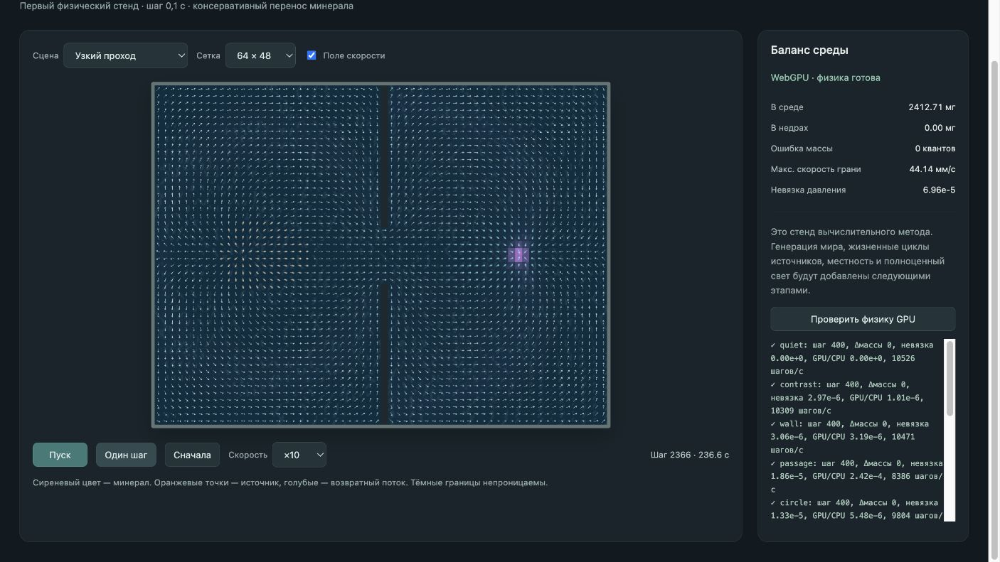
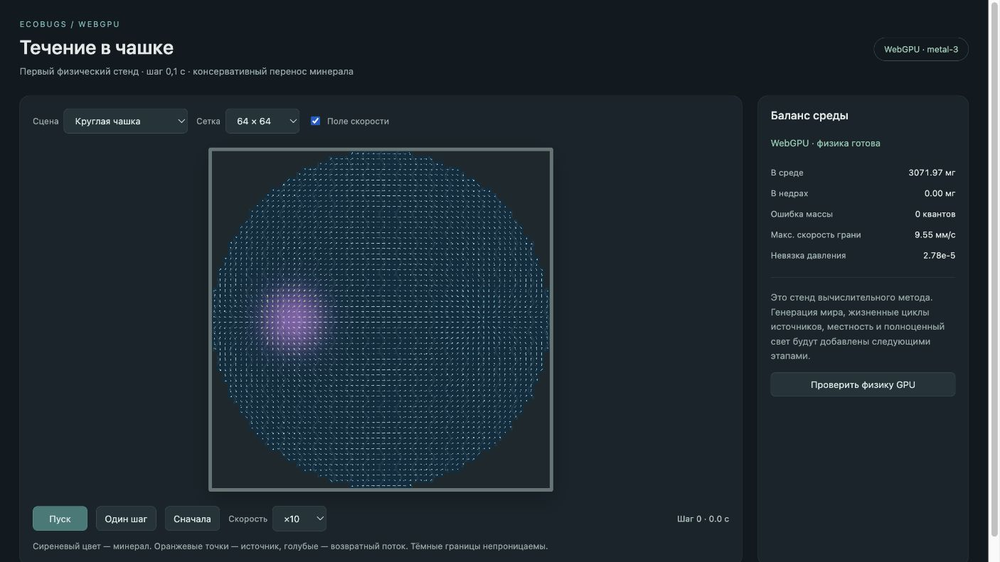

# Первый физический GPU-стенд

2026-10-03. Утверждённые правила и планы закоммичены в `0de3b14`. Новая реализация находится в `world-gpu/`; прежний `world/` не изменён и не удалён.

## Что реализовано

- Отдельный проект Vite/TypeScript, адрес разработки `http://127.0.0.1:5174/`. WebGPU обязателен; нет рендера или расчёта на запасном API. Новая зависимость `@webgpu/types` используется только для типов, графического фреймворка нет.
- WGSL-решатель давления weighted Jacobi, проводимость граней с сопротивлением 1:3:9, закрытые внешние границы и перегородки. Источники сбалансированы отдельно в каждой связной области. Скорости хранятся на гранях.
- Консервативный перенос: GPU считает исходящие порции, затем соседние клетки списывают/получают те же целочисленные величины. Масса — кванты 0,001 мг, остатки переноса хранятся отдельно. Бюджет слоя ограничен сопротивлением; суммарный выход не превышает запас донора.
- Поле, массы и служебные буферы находятся на GPU. Изображение читает их непосредственно; обычная сводка получает только групповые редукции, полный снимок читается при числовых проверках.
- Отверстие принимает вещество и не выпускает его при обратном течении. Избыток переходит в отдельный резервуар недр; короткий двухсекундный выброс переносит зарезервированный грамм из недр в среду. Это контролируемые тестовые операции, не полные жизненные циклы источников.
- Восемь сцен, выбор сетки, пуск/пауза, одиночный шаг, ×1/×10/×100, поле скорости и кнопка реальных GPU-проверок. Физический шаг 0,1 с, пакеты ограничены; скрытие вкладки ставит модель на паузу без догоняния.

## Проверки

`npm run check`: 24 комбинации сцены и сетки — повторяемые начальные данные, баланс источников по связным областям, нулевая масса в стенках, допустимый диапазон целочисленного учёта. `npm run build`: TypeScript и production-сборка проходят.

Встроенный браузер предоставляет реальное устройство WebGPU (`metal-3`). На GPU проверены:

- Восемь сцен на сетке 32×24, для круга 32×32. Давление сопоставлено с независимым малым CPU-решателем того же уравнения; максимальные различия от 0 до 2,42·10⁻⁴ на этих сценах. CPU-решатель — инструмент проверки, не альтернативный движок приложения.
- Баланс всей массы, отдельных закрытых отсеков, отсутствие массы в стенках и NaN/Infinity. Бездействующая среда не меняется.
- Повтор запуска и другое разбиение тех же 400 шагов на пакеты дают одинаковый массив масс. Это проверка на одном GPU, не межустройственный аудит.
- Узкий проход ускоряет поток более чем вдвое; расход соседних узкого/широкого сечений отличается меньше чем на 1%.
- Воронка поглощает избыток, при обращении внешнего потока минерал остаётся в отверстии. Короткий выброс полностью отдаёт зарезервированный объём без потери массы.
- При сильном потоке проверены бюджеты подвижного слоя: не больше всего запаса в воде, трети на отмели и девятой части на суше за тестовый шаг. Начальные доноры выбраны вне точки схождения, чтобы проверка действительно включала выходящий поток.
- Сетки 64×48 и 128×96: нулевой дрейф массы, относительные невязки давления 1,46·10⁻⁵ и 4,41·10⁻⁵. Это проверка сходимости решателя на каждой сетке, не завершённый аудит сходимости транспортного метода по разрешению.
- Длинный прогон на 100 000 шагов с сеткой 32×24: ошибка массы и утечки равны нулю.

В интерфейсе проверены движение минерала на ×10, остановка возраста на паузе и переход ровно на один шаг: 2365 → 2366. Журнал предупреждений и ошибок браузера при этой проверке пуст.

После исправления подписей размера сетки отдельно просмотрена круглая сцена 64×64: невязка 2,78·10⁻⁵, ошибка массы 0, журнал ошибок пуст. Предпросмотр оставлен на этой сцене на паузе с включённым полем скорости.

Точный вывод последнего прогона: [checks.txt](world-gpu-prototype-2026-10-03/checks.txt). Значения скорости в нём — однократные измерения подготовки/отправки/завершения транспортных шагов без изображения, без начального решения давления. Они не доказывают ускорение полного мира; GPU timestamps, три сравнительных прогона и исходный CPU-мир ещё не измерены в сопоставимой конфигурации.

## Найденное ограничение и следующий шаг

Простой Jacobi медленно сходится в проходах. Первый прогон дал невязку около 0,048 на малой сцене и был отклонён. Увеличение фиксированного числа итераций снизило невязку до 1,86·10⁻⁵ на 32×24 и 6,96·10⁻⁵ на 64×48. Для динамического полного мира такое количество проходов может быть слишком дорогим: следующий численный эксперимент — многоуровневый решатель или другое ускорение сходимости, с измерением времени обновления поля.

В стенде пока нет полного генератора мира, солнечного увлечения, затухающей задачи вулканов/воронок, диффузии, эрозии, залежей, грунта, подвижек, сохранений, камеры/миникарты и восстановления физического состояния после потери устройства. При потере устройства показывается ошибка; требуется перезапуск страницы. Круглая граница ступенчатая, её свободная площадь приближённая. Перенос первого порядка размывает компактные пятна и требует сравнения с более точной схемой. Тестовое изображение не является финальным художественным решением.

Двигаться дальше можно: базовая консервативная схема исполняется на GPU, имеет проверяемый баланс и пригодна для следующих экспериментов. Победа над текущим миром и соответствие всей спецификации ещё не установлены.

