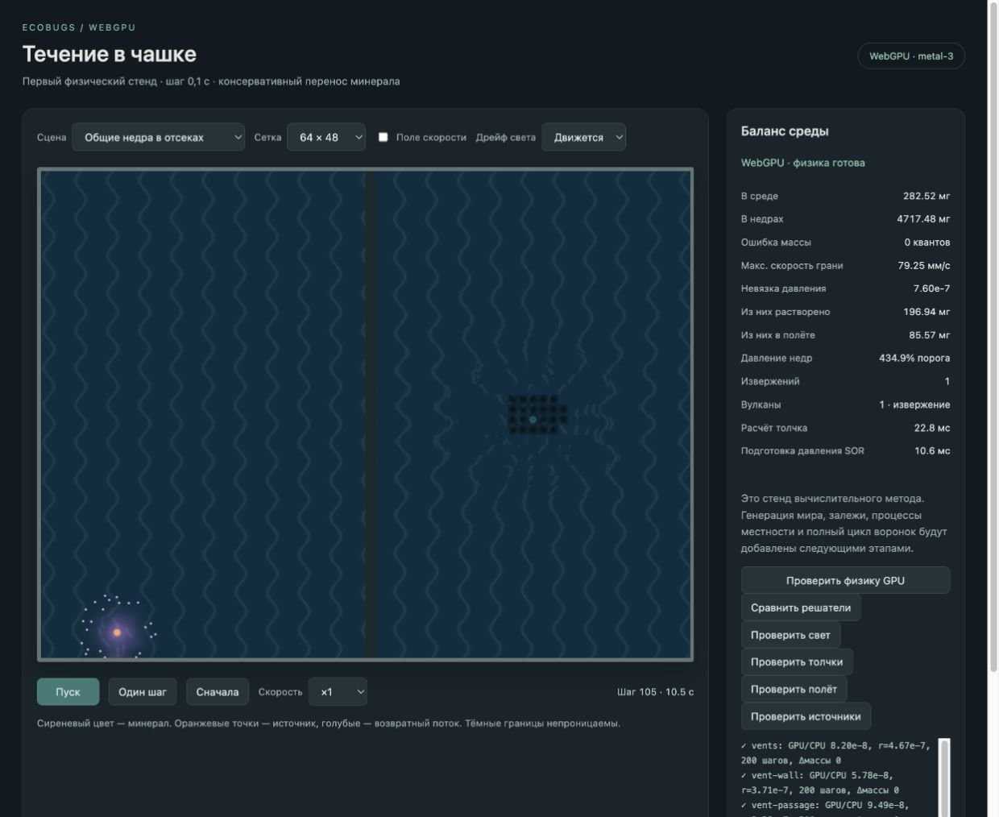

# GPU-мир: общий запас недр и цикл вулкана

Дата: 2026-10-03. Предыдущая доработка столкновений и смешивания зафиксирована коммитом `08f2ed2`. Этот этап добавляет общий резервуар минерала и вулканы, запускаемые давлением, в отдельный `world-gpu`.

## Что реализовано

Общий доступный запас хранится на GPU целыми квантами 0,001 мг. В начале извержения выбранный объём резервируется один раз: доля залпов переходит в резерв жерла, доля истечения — в отдельный резерв. Залпы передают массу реальным движущимся порциям, истечение — растворённому полю у жерла. Поглощённый отверстиями избыток возвращается в общий запас GPU-проходом; резервуар связывает даже закрытые отсеки. Полный баланс включает доступный запас, оба резерва, растворённое вещество и полёт.

Движение порций и поле среды остаются на GPU. Малый контроллер событий TypeScript читает сводку в начале каждого интервала из 100 шагов (10 модельных секунд) и выбирает переходы по давлению на начало интервала. Возврат минерала внутри интервала влияет на следующий запуск. Сила вулкана интегрируется по полному интервалу 10 с, поэтому короткие события между выборками не теряются. Свет в прежних сценах обновляется раз в секунду; это отдельная частота.

В новом состоянии вулканов нет. Первый шаг может начать подготовку при запасе не меньше 0,6 порога; созревший вулкан ждёт полного порога. При свободном автомате выбирается новый вулкан или спящий, причём сильные спящие имеют больший вес. Новые места выбираются по сиду среди свободных клеток вне отверстий и занятых жерл. При достаточном давлении извергается один вулкан. После извержения он засыпает или угасает; давно спящий тоже начинает угасать, затем удаляется.

Извержение состоит из 1–4 залпов и убывающего истечения. Первый залп самый сильный, последующие примерно вдвое слабее по массе; время повторов определяется сидом, их короткие интервалы не перекрываются. Бюджет делится на 60% залпов и 40% истечения; целочисленный остаток распределяется без потерь. Дальность первого залпа — примерно 50–150 мм по мощности, последующие короче. Скорость также зависит от мощности. Истечение использует убывающий линейный профиль, интеграл которого рассчитывается аналитически; разности округлённых накопленных масс дают точную выдачу за шаг.

Стартовая серия ускоряет подготовку и профили извержений в 100 раз. После первого падения давления ниже порога она завершается; обычные события больше не ускоряются. Для контролируемой сцены выбран запас 5 г, пороги 20–35% опорного запаса, объём извержения 3–12% по мощности. Обычная подготовка — 4000–7000 шагов, извержение — 5000–10000; эти коэффициенты стенда требуют дальнейшей калибровки полного мира. Спящие угасают после 200–400 тысяч шагов, исчезновение после угасания занимает 20 тысяч.

Масса в полёте списывается с исходного жерла каждой порции, поэтому смена активного источника не портит учёт уже движущегося вещества. Пул для автоматических источников должен вмещать не меньше 16 пакетов выдачи: при выбранном отношении дальности и скорости максимальная длительность собственной инерции в воде около 1,25 с. Это предотвращает задержку залпа из-за заполнения пула. Старые независимые сцены полёта сохраняют проверку очереди малого пула.

Добавлены сцены «Жизнь вулканов» и «Общие недра в отсеках», кнопка «Проверить источники», маркеры состояний, давление недр и счётчик извержений в сводке. Крупные поля для кадра или автомата не читаются на CPU; загружаются только небольшие команды обмена, события и маркеры изменившихся источников.

## Проверки

Реальный WebGPU `metal-3`; [протокол источников](world-gpu-sources-2026-10-03/source-checks.txt):

- 500 шагов стартовой серии: два извержения, один активный автомат; масса, GPU-сводка и сумма живых порций проверяются на каждом шаге.
- Пустой резервуар не создаёт вулканов. Поглощённый минерал из левого закрытого отсека резервируется и выбрасывается в правом: 72,92 мг вышло в правом отсеке, поток через перегородку равен нулю.
- Отверстие вернуло 87,49 мг избытка в общий запас, сохранило обычный слой и точный полный баланс.
- 1200 шагов с различной разбивкой команд: шесть извержений; массы, порции, запас недр, скорость и состояние контроллера совпадают. Дальнейший прогон до 3000 шагов сохраняет массу; ошибок резервирования и интеграции нет.
- Сетки 64×48 и 128×96: резервирование, залпы, истечение и баланс прошли.
- Node-проверки 72 начальных сцен и 20 сидов: пороги подготовки/запуска, 1–4 ослабевающих залпа, их непересечение, точная сумма залпов и истечения, интегральный толчок и угасание спящего вулкана.

Повторные [проверки полёта](world-gpu-sources-2026-10-03/flight-checks.txt) прошли после изменения учёта исходного жерла и добавления общего резервуара. [Проверки переноса](world-gpu-sources-2026-10-03/physics-checks.txt), включая 100 000 шагов, прошли без потерь массы и протечек. [Проверки толчков](world-gpu-sources-2026-10-03/vent-checks.txt) подтвердили интеграл силы, изоляцию перегородок и повторяемость. Сборка TypeScript/Vite прошла.

Ручная проверка сцены «Общие недра в отсеках»: начальное состояние без вулканов → подготовка на шаге 60 → первое извержение на шаге 105. На паузе в среде 282,52 мг, в недрах 4717,48 мг, ошибка массы 0 квантов; видны летящие порции и растворённое вещество. Ошибок и предупреждений в консоли браузера нет. Сцена оставлена открытой на скорости ×1.

## Границы и следующий этап

Это управляемые геометрия, запас и отверстие, а не полный генератор мира. Выбор места вдали от залежей пока не подключён: карты залежей ещё нет. Нет рождения, усиления и угасания воронок от скоплений; постоянное контрольное отверстие и его тяга проверяют обмен с общим запасом. Детальная анимация набухания жерла перед повторным залпом относится к будущему изображению, текущий маркер показывает состояние автомата.

Профили и пороги связаны с сидом и давлением, однако коэффициенты, глобальный масштаб запаса и границы числа источников предстоит проверить на полном цикле. Самостоятельная модель инерционной волны среды не вводилась. Сохранения состояния автомата и восстановления устройства ещё нет; для будущего сохранения нужны также счётчик генератора, список вулканов, профили и все резервы.

Следующий этап — растекание растворённого минерала, оседание и растворение залежей с точным балансом. После появления карты залежей можно реализовать выбор мест вулканов и полный автомат воронок, затем процессы местности.
