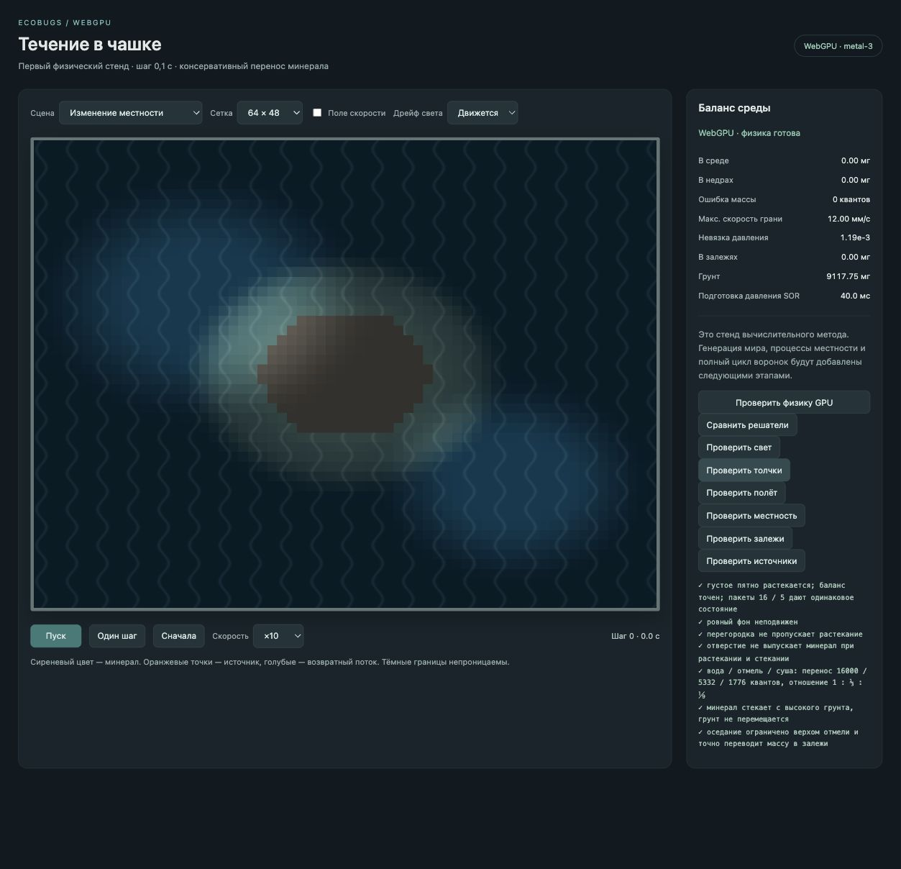

# GPU-мир: местность, подвижки и толчки

2026-10-03. Предыдущий этап минерала — `2f75c04`. Контрольные сцены дополнены изменением грунта, сопротивления и общих недр.

## Процессы

Размыв действует от скорости общего течения: сначала снимается масса залежей, и только оставшийся запрос снимает грунт. Нижняя граница грунта — ноль. Выветривание действует на склонах, выше середины отмели; ровная середина суши не изменяется. Оба процесса переводят массу в растворённое поле. Их дробные остатки хранятся на GPU, обмен целочисленный.

Сопротивление пересобирается по грунту и залежам каждые 100 модельных шагов; переходы между водой, отмелью и сушей непрерывны. После пересборки решатели света/толчков получают новые проводимости. Снимок проверки теперь содержит фактическую геометрию GPU, а не только начальную CPU-карту. Фиксированная частота и число итераций не зависят от изображения и разбивки команд.

Подвижки и толчки определяются сидом. Подвижка состоит из плавно поднимающегося пятна или полосы и такого же соседнего опускающегося участка; толчок — короткий локальный подъём или проседание. Интегральная форма во времени — smoothstep. CPU хранит только небольшие события, GPU строит запросы клеток, сначала возвращает опускающийся грунт и затопленные залежи в общий запас, затем распределяет доступный запас между подъёмами. Недостаток запаса ограничивает подъём; создание вещества запрещено. Распределение ограниченного запаса использует накопленные доли и целочисленный остаток.

В нормальном расписании интервал подвижек 100–300 тысяч шагов, длительность 150–350 тысяч, толчок длится 200–600 шагов. Для видимой контрольной сцены интервалы сокращены до порядка 1000/2000, подвижка длится 3000 шагов. Это ускоренный стенд, не параметры полного мира. Скорость местности масштабирует процессы и время подвижек; ноль выключает оседание, растворение, стекание, размыв, выветривание, подвижки и толчки. Растекание остаётся процессом среды.

Текущая калибровка грунта и пределов соответствует малому запасу стенда. Генерация полного мира, физический масштаб грунта и допустимый диапазон суммарных целых масс ещё впереди. Стационарный проход распределения подъёмов выполняется последовательно на GPU; стоимость на полном мире нужно измерить. Одновременно допустимы 16 событий; превышение останавливает расчёт, не теряет события молча.

## Проверки

Реальный GPU `metal-3`: [протокол](world-gpu-terrain-2026-10-03/terrain-checks.txt). Проверены приоритет размыва залежей перед грунтом, переход грунта в среду, устойчивость плоской суши, предел выветривания, нулевая скорость местности, уровень и сопротивление, пересчёт света и течения. Подвижки и толчки меняют грунт, проседание топит залежи; полный баланс точен. Повтор 1500 шагов с пакетами 16 и 5 совпал, включая недра и события. Пустые недра и грунт не создают вещество.

[Повторные проверки минерала](world-gpu-terrain-2026-10-03/mineral-checks.txt) проверяют прежние обмены после расширения процессов. Сборка TypeScript/Vite и Node-проверки 81 сцены прошли.

Следующий проход — автоматы воронок и выбор мест вулканов по карте залежей.
