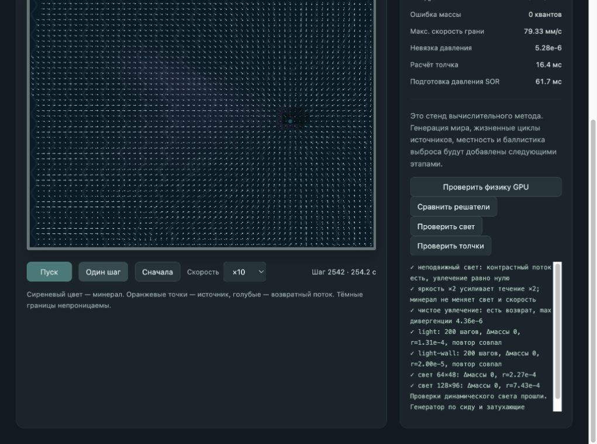

# Затухающие толчки GPU

2026-10-03. Световой этап зафиксирован в `433d0d5`. Следующий проход добавляет физическое поле толчков и тяги в `world-gpu`. Старый `world` не изменён.

## Расчёт и интеграция

Солнечная задача остаётся отдельной. Для вулканов и воронок GPU решает экранированную задачу:

`Σ c(k,j) × (p(k) − p(j)) + λ(k) × p(k) = q(k)`.

Проводимость грани `c` — гармоническое среднее подвижности соседей. Трение `λ = cell² / (L² × mobility)`, где контрольная дальность `L = 200 мм`. В однородной среде характерная дальность равна `L × mobility`: 200 мм в воде, около 66,7 мм на отмели и 22,2 мм на суше. Это свойство выбранного уравнения; точность дискретного профиля по разрешению ещё предстоит измерить. Непроницаемые грани имеют проводимость ноль. Трение делает задачу определённой без подбора парного стока: источники независимы и не знают друг о друге.

Правая часть `q` — знаковая вытесненная площадь в мм²/с, делённая на площадь клетки. Положительная сила толкает, отрицательная тянет. Совпадающие источники складываются до деления на площадь, чтобы равные противоположные силы компенсировались точно. Первоначальная проверка компенсации выявила малый остаток при раздельном делении; порядок вычисления исправлен.

Red-black SOR использует коэффициент 1,6 и `max(256, cols²/8)` циклов, с нулевого начального давления. Скорость толчка на гранях складывается с солнечной скоростью. Перенос минерала, диагностика и изображение читают одно итоговое поле. Невязка учитывает и распределённое затухание: `div(v) = q_sun + q_push − λp`. Масса минерала сохраняется отдельной консервативной схемой; трение не списывает вещество.

Обновление — раз в модельную секунду, перед шагами 0, 10, 20… Сила берётся как интеграл события за интервал, делённый на его длительность. Контрольный залп 0,25–0,45 с целиком попадает в первый интервал, несмотря на отсутствие залпа на его концах. Среднее воздействие применяется ко всему интервалу, включая его начало: пик не рассчитывается отдельной инерционной волной. Это фиксированная дискретизация стенда, не полный автомат извержений.

Зарезервированный грамм минерала выходит за три шага: 250 000, 500 000, 250 000 квантов. Порции вычисляются как разность округлённых накопленных счётчиков, списываются из GPU-резерва и добавляются в среду у жерла. Вулканическое вещество пока вводится локально; баллистический полёт не реализован. Стенд явно допускает только одно активное жерло с резервом. Общее давление недр, подготовка и судьбы вулканов, формы/ареолы и жизненные циклы воронок впереди.

Небольшой список событий и его интегралы задаются на CPU; большая сеточная задача выполняется на GPU. Неизменные интегральные силы переиспользуют готовое поле. Кеш действителен только для фиксированной геометрии стенда; сброс уничтожает его. Изменение местности в будущем обязано инвалидировать кеш. При изменении силы задача заново решается с нуля. CPU не читает полные поля для кадра или пересчёта.

## Проверки

Реальный WebGPU `metal-3`, встроенный браузер. Добавлены пять сцен: залп/тяга, закрытые отсеки, проход, три среды и совместное солнечное течение. [Точный вывод](world-gpu-vents-2026-10-03/vent-checks.txt):

- Независимый CPU-решатель Float64 проверяет начальное давление толчка на 32×24. Относительное максимальное различие — 4,38·10⁻⁸–9,49·10⁻⁸ на контролируемых сценах.
- Стенки не пропускают поток; одиночный источник не влияет на закрытый соседний отсек, а проход передаёт воздействие на другую сторону перегородки.
- При одинаковом источнике поток в 200 мм от него: вода 4,33 мм/с, отмель 0,782 мм/с, суша 0,00317 мм/с. Это три однородные контрольные среды, не средние скорости всего мира.
- Короткий залп не теряется между выборками; частичная выдача минерала точна, резерв полностью опустошается. После завершения интервала поле одиночного выключенного залпа равно нулю.
- Совместная скорость равна сумме отдельно рассчитанных солнечного и затухающего полей; равные противоположные силы в одной клетке компенсируются.
- Обратный толчок из отверстия не выносит минерал: избыток уходит в учтённый резервуар, обычный слой остаётся.
- Другие пакеты тех же шагов дают одинаковые массы, скорости и давление толчков на этом устройстве. Совместный поток проверен на 1000 шагов без дрейфа массы.
- Сетки 64×48 и 128×96: начальные относительные невязки 7,03·10⁻⁷ и 1,48·10⁻⁶; масса сохраняется после обновления поля. Порог проверки — 10⁻³. Сводка совпадает с полным снимком.

Сборка TypeScript/Vite, проверка 45 начальных сцен/сеток и интеграла короткого события проходят. Прежние физические сцены повторно прошли проверки, включая 100 000 шагов без дрейфа массы и утечек. [Вывод регрессии](world-gpu-vents-2026-10-03/physics-checks.txt). Световой аудит также прошёл после изменения общего формата буферов: [вывод проверок света](world-gpu-vents-2026-10-03/light-checks.txt).

В интерфейсе совместная сцена 64×48 просмотрена на ×10 до шага 2541: после залпа минерал переносится солнечным полем и тягой воронки, часть уходит в учтённый резервуар. Ошибка массы остаётся нулевой. Счётчик стабилен на паузе; один шаг даёт 2541 → 2542. Ошибок и предупреждений браузера нет. Предпросмотр оставлен на этой сцене на паузе с полем скорости.

## Следующий этап и ограничения

Это проверка метода физического поля, не готовые извержения. Следующий этап — баллистический выброс и автомат вулкана с резервированием вещества и интегральной силой; затем давление общих недр и жизненные циклы источников. Первая воронка пока задана сценой и имеет постоянную полную силу, не рождается из залежей.

Большие сетки, меняющаяся местность, пространственная сходимость, длительная динамика и другие GPU ещё требуют аудита. Показатель «Расчёт толчка» — время последнего фактического решения до завершения очереди, а при попадании в кеш нового решения нет. Это не сравнительный замер всего мира. Финальное оформление местности, ряби и жерла также впереди.

