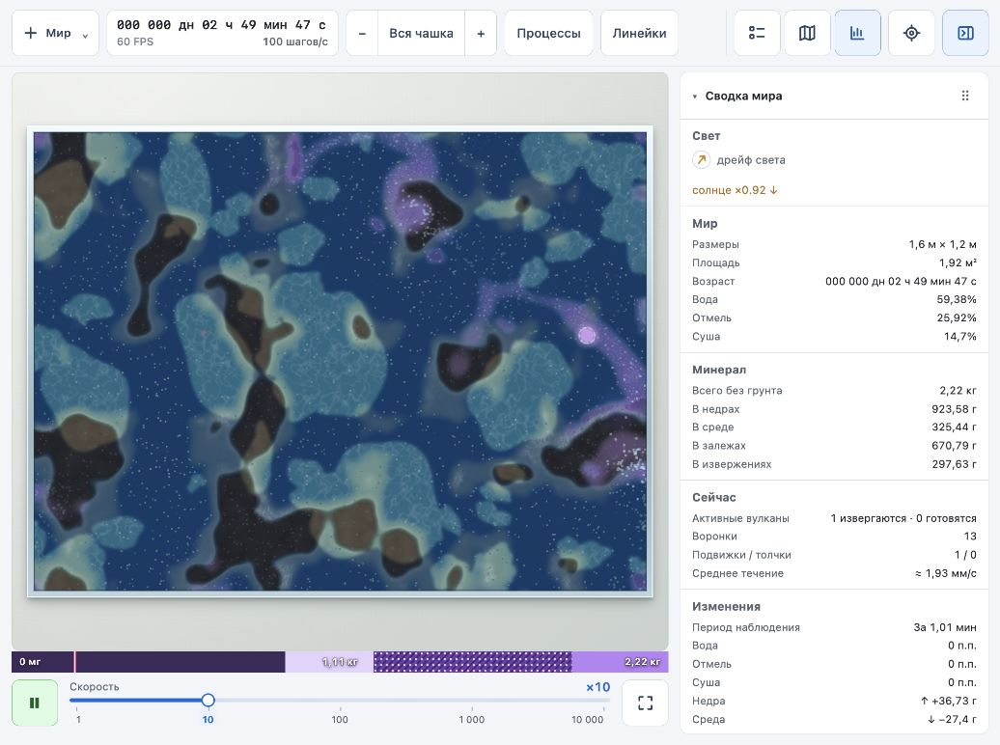
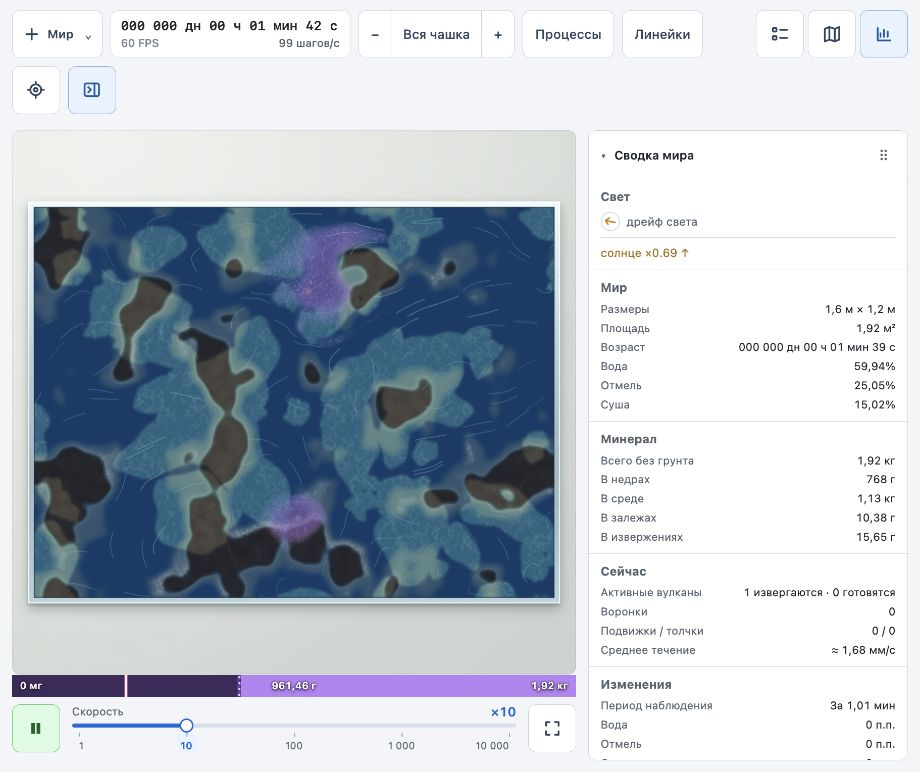

# Зернистый показ течений

Статус: эксперимент отклонён пользователем. Зёрна, их группировка и последующий слой переносимой текстуры удалены из рендера. Описание ниже сохраняет результаты первой пробы.

2026-10-03. Изменены только рендер в `world` и документация в `docs`.

- Вместо голов и хвостовых кривых — матовые зёрна 1,3–1,9 CSS px, движущиеся по суммарному полю течения. Плотность не кодирует скорость или запас минерала.
- После первой оценки плотность увеличена: шаг экранной сетки 11 CSS px на общем плане и 9 CSS px при приближении, предел 3000 меток. Независимая физика песка, свечение и дополнительные холсты не добавлены.
- До 27 пакетных заполнений квадратов; построение кривых удалено. Стоимость перемещения растёт с числом меток, поэтому снижение затрат на кривые само по себе не доказывает ускорение всего кадра.
- Сборка с проверкой TypeScript и `git diff --check` прошли.
- В браузере проверен текущий мир с сидом 1: общий план и приближение ×4,2, движение на ×1 и ×10. Между снимками на ×1 видны изменения положения зёрен. Индикатор при проверенных масштабах показывал 60 FPS; после работы на ×10 — 100 шагов/с. Это наблюдение текущего сеанса, не сравнительный профилировочный замер.
- При среднем течении около 2 мм/с в чашке шириной 1600 мм, отображаемой примерно на 635 CSS px, среднее экранное смещение на ×1 — около 0,8 CSS px/с. На общем плане движение остаётся медленным; увеличение плотности улучшает видимость текстуры, но не увеличивает физическую скорость. При приближении и на ×10 смещение читается лучше.
- В доступном журнале браузера ошибок и предупреждений нет. Предпросмотр оставлен работающим на ×10, в масштабе всей чашки.

## Промежуточный вариант: линии тока

Этот вариант позднее заменён первым [шейдерным показом ряби](world-shader-flow-2026-10-03.md).

- Вернута геометрия линий текущего поля, удалены головы и хвостовое затухание. Толщина равномерная, 0,75 CSS px; длина и контраст зависят от силы потока. Вместо дополнительных обводок отрисовка выполняется девятью пакетными проходами.
- Сохранены предел 600 меток, кеш кривых, не более 150 перестроений за кадр и бюджет 1,5 мс. Длина 18–52 CSS px с пределом 96 мм; распределение 34–26 CSS px в зависимости от зума. Численная модель не менялась.
- Сборка TypeScript/Vite и `git diff --check` прошли. В браузере проверен общий вид на ×10, индикатор показывал 60 FPS; это наблюдение, не сравнительный замер производительности.
- Предпросмотр оставлен работающим на ×10 для оценки пользователем. В коде экспериментальной зернистой текстуры больше нет.

