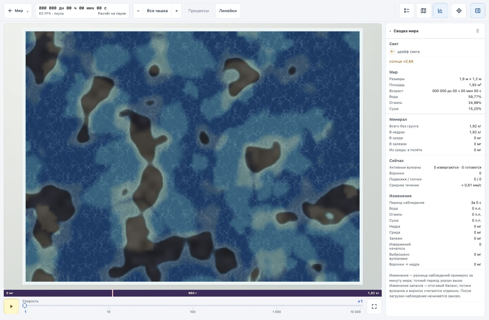

# Возврат визуального языка старого мира

По указанию пользователя старый `world` остаётся визуальным ориентиром. Прежние художественные изменения GPU-кандидата не являются целью миграции.

В `world-gpu` перенесены из старого рендера палитра воды/камня/залежей/минерала, пороги переходов местности, береговые полосы, цвет тени и солнца, порядок multiply/screen, логарифмическая прозрачность минерала и коэффициент мутности. Рябь использует ту же бесшовную текстуру 256×256 и масштабы 160/235 мм, загружается один раз при создании мира и движется по физическим материальным координатам GPU. Возвращены светлые небольшие крупинки, их размер в полёте привязан к CSS-пикселям, рамка чашки и отступ стола.

Расчёты физики не изменены. Формат и размер render-uniform сохранены; дополнительные параметры оформления упакованы только в ранее графические поля. Зерно в растворённом минерале — графическая выборка адвектируемых координат, не новая масса и не отдельная физика вещества. Текстура освобождается при пересоздании мира.

Проверено: сборка, компиляция WGSL в браузере без ошибок, сопоставление начального вида на сиде 1, движение ×10 до шага 2659 с несколькими извержениями, изображение минерала и крупинок. Новых замеров производительности не проводилось.

Пиксельное совпадение не заявляется: поле света и местности интерполируется из GPU-сетки, мелкая фактура камня и расположение графических крупинок вычисляются иначе. Для следующей проверки соответствия сохранить прежний вид источников/воронок и улучшить гладкость световых контуров на малой сетке; не менять палитру ради маскировки дискретизации.

