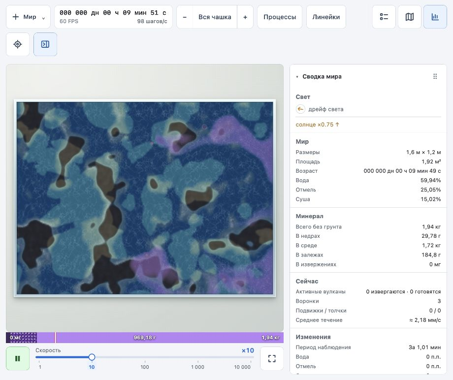
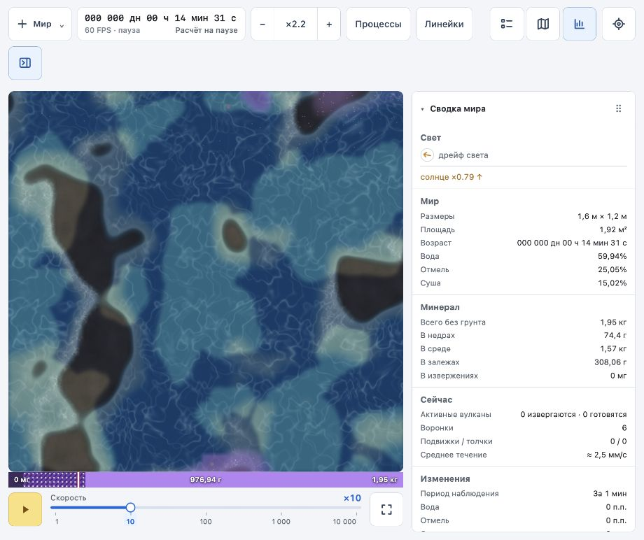

# Первый шейдерный вариант течения

2026-10-03. Изменения только в `world` и `docs`; численная модель и формат сохранений не менялись.

Это отчёт о первом варианте. Последующее исправление физики вулкана и повышение точности карты скорости описаны в [следующем проходе](world-volcano-physics-2026-10-03.md).

## Реализация

- Вынесен WebGL-проход ряби в `world/src/app/water-flow-shader.ts`. Результат рисуется в существующий слой бликов Canvas 2D; весь мир на WebGL не переводился.
- Использована существующая текстура ряби. Два фазовых цикла по 8 с мира смешиваются для ограничения деформации; два масштаба рисунка — 160 и 235 мм. Текущая скорость из `flowAt` определяет перенос и немного влияет на контраст. Тёмная шумовая текстура и отдельные линии тока удалены.
- Карта скорости до 64 × 64 точек, обновление до 10 раз в секунду; на смену камеры реагирует сразу. Общий масштаб кодирования компонентов скорости в байтовой текстуре выбирается по максимуму поля. Это приближённое поле; на слабых потоках рядом с сильным источником точность кодирования ниже.
- Рябь видна на воде и отмели, маска плавно затухает к суше. Она больше не ограничена отдельными пятнами света. Цвет местности не заменяется шумом.
- GPU рисует один прямоугольник, длинная сторона его растра не превышает 1024 пикселя. CPU не строит кривые и не переносит тысячи визуальных частиц. Копирование результата GPU в Canvas 2D остаётся частью стоимости кадра.
- При недоступности WebGL используется статическая рябь. Обработаны события потери и восстановления контекста; ресурсы восстанавливаются повторной инициализацией. В режиме «Процессы» сохранены стрелки поля.

## Проверка

- `npm run build` прошёл, включая TypeScript; `git diff --check` без ошибок.
- В браузере атрибут основного холста `data-flow-renderer` подтверждает `webgl`. При включении «Процессов» меняется на `canvas2d`, после выключения возвращается на `webgl`.
- Просмотрены общий план и ×2,2, движение на ×10, пауза и возобновление. На паузе возраст оставался 00:14:31; после пуска продолжил расти. В доступном журнале ошибок и предупреждений нет.
- Индикатор при проверке показывал 60 FPS. Это наблюдение одного сеанса, не сравнительное измерение времени CPU/GPU. Потеря контекста, отсутствие WebGL, круглая чашка, другие DPR и длительный прогон пока не проверялись.
- Визуальный эффект — первый прототип для оценки пользователем. Фазовое смешивание показывает движение текущего поля, но не гарантирует исторически точных траекторий при изменении скорости.
- Предпросмотр оставлен работающим на ×10 с приближением ×2,2. Изменения не закоммичены.

Подход к фазовому смешиванию: [Alex Vlachos, Valve — Water Flow, SIGGRAPH 2010](https://cdn.cloudflare.steamstatic.com/apps/valve/2010/siggraph2010_vlachos_waterflow.pdf).

