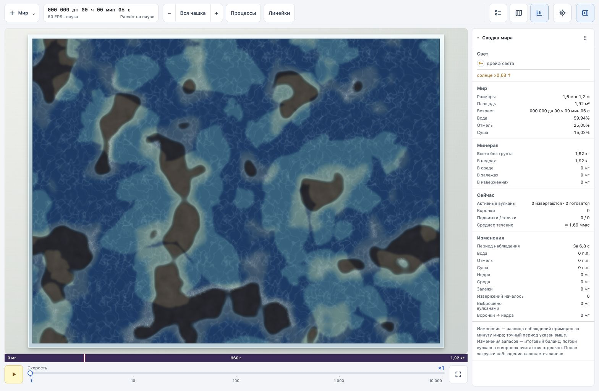
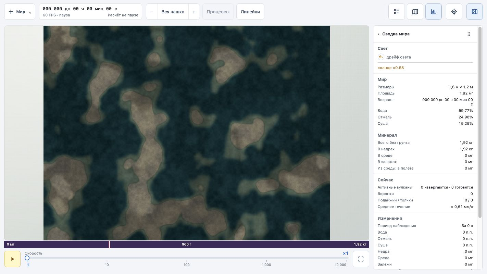

# Возврат старого мира и его интерфейса

`world` восстановлен из `7237b18`, запущен на http://127.0.0.1:5173/. `world-gpu` сохранён отдельно, запущен на http://127.0.0.1:5174/. Замена возможна только по решению пользователя.

В кандидате используются прежние HTML/CSS, Panel, Sidebar, WorldSummary и CoordinateRulers с адаптером GPU-данных. Проверены сборки обеих версий и браузерные действия: пуск/пауза, ×10, линейки, миникарта, закрепление точки, форма параметров и создание мира. Проверка GPU-сохранения подтвердила JSON и одинаковое продолжение 175→305 для cycle/world, а также восстановление после потери устройства. Выгрузка файла через автоматизацию браузера не подтверждена: событие download не вернулось; это не считается успешной проверкой загрузки файла через меню.

Для полной идентичности остаются карта обменов «Процессы» и жест двумя пальцами. Кнопка процессов отключена с пояснением; карта скорости доступна в диагностике отдельно.

Старый интерфейс:

Прежняя оболочка с GPU-движком:

