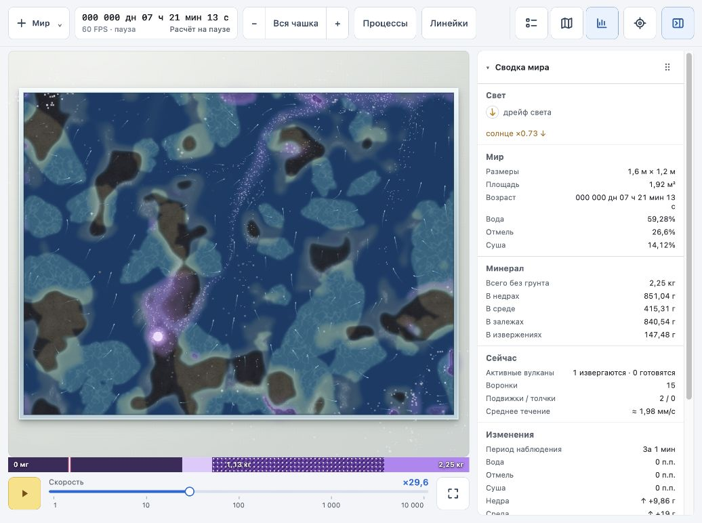
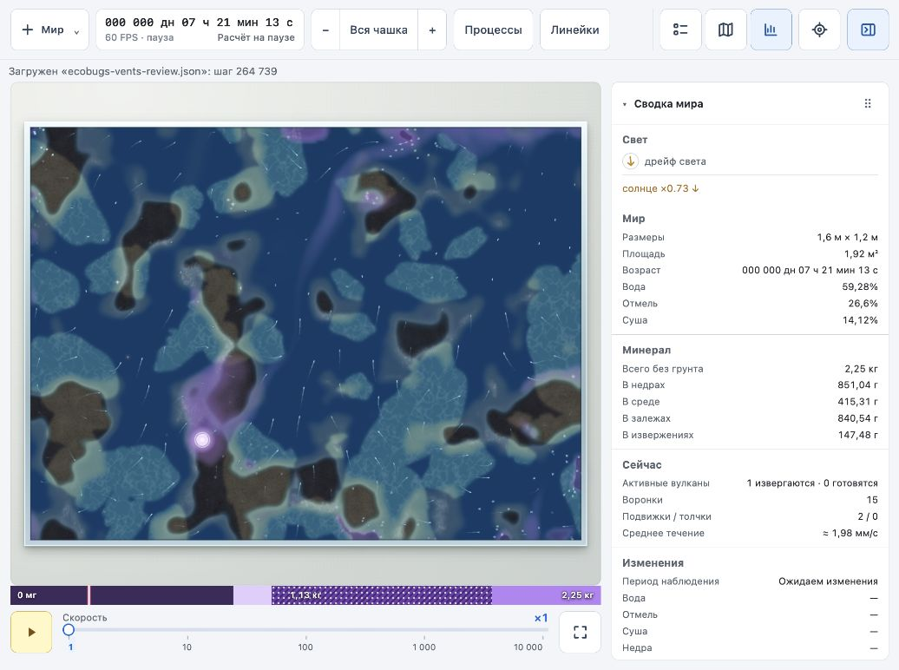
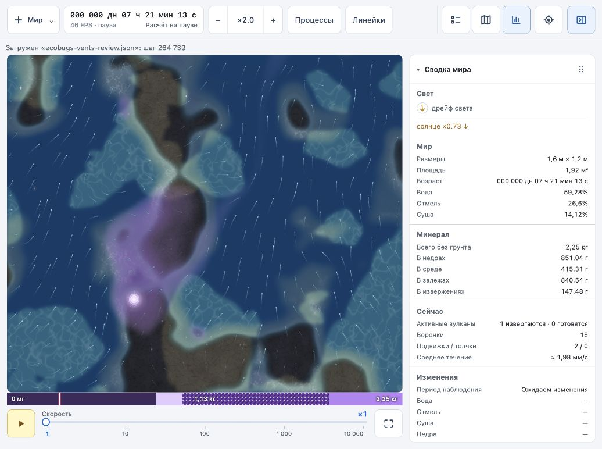
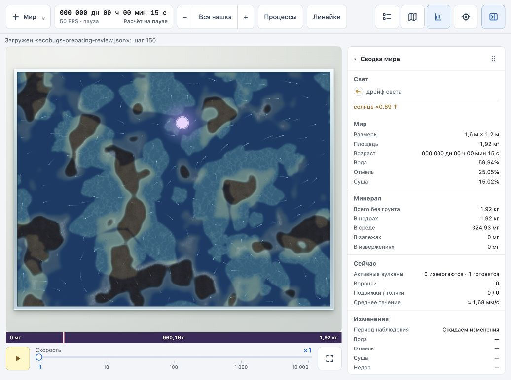
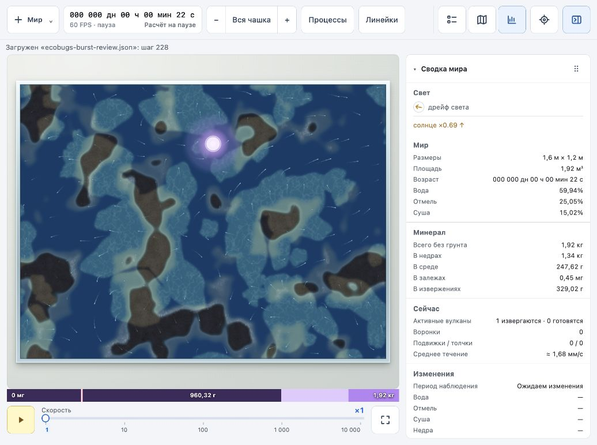
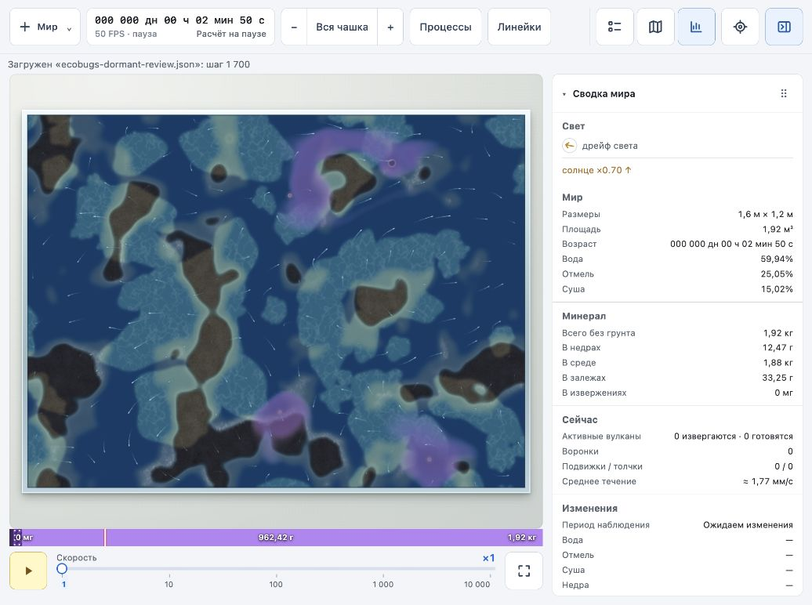

# Третий проход наглядности: вулканы и воронки

2026-10-03. Изменены `world/src/app/render.ts`, пояснения и образцы в легенде, документация. Расчёт мира и формат сохранений не менялись.

## Жерла

- Тонкая кромка отделяет жерло от минерала в среде. При подготовке она светлеет вместе с диском; при залпе — почти белая, между залпами — сиреневая.
- Белая сердцевина привязана к существующему `burstState`, то есть к расписанию залпов данного вулкана. Новая расходящаяся волна не добавлена.
- Спящий вулкан — небольшой матовый диск с тусклой кромкой. У потухшего диска и кромки размер и яркость спадают по фазе угасания.
- Частицы притока показываются и при загрузке на паузе: начальное размещение определяется хешем номера вулкана, извержения и частицы. Дальнейший пересев требует продвижения шагов мира. Частицы вне чашки и на перегородках скрываются.
- В легенде исправлено прежнее описание расходящихся колец; теперь описаны подготовка, залп, истечение, сон и угасание.

## Воронки

- Ступенчатые концентрические линии внутри отверстия заменены непрерывным затемнением. Кромка мягче, непрозрачность отверстия снижена с 0,6 до 0,48, кромки — с 0,75 до 0,45. Свечение снижено с 0,7 до 0,22, чтобы сток отличался от источника.
- Частицы стока голубоватые, с короткими условными следами назад по реальному полю течений. Вращение не добавляется. В отверстии частица останавливается, уменьшается и одновременно гаснет; завершающая искра слабее и меньше.
- Следы собираются в один `Path2D` на воронку и рисуются одним вызовом, вместо отдельных вызовов на каждую частицу.
- На воронку по-прежнему не более 40 частиц. Визуальная жизнь увеличена с 6 до 30 секунд анимации, треть частиц размещается ближе к центру, чтобы стягивание было видимо и на ×1. Начальное размещение определяется хешем номера воронки и частицы; на паузе дальнейший пересев отключён.
- При смещении частицы проверяются середина и конец перемещения на попадание вне чашки и в перегородки. Существующее ограничение перемещения 10 CSS px за кадр сохранено; на больших ускорениях частицы остаются условным показом движения, а не измерителем пройденного расстояния.

Размеры вспышек, пульсация, затухание и визуальные сроки жизни используют прежнее время анимации приложения, которое стоит на паузе. Перемещение частиц использует шаги мира. Частицы не входят в физическое состояние или хеш.

## Проверка

- `npm run build` прошёл, включая проверку TypeScript; `git diff --check` без ошибок.
- Просмотрены естественные состояния с сидом 1: подготовка на шаге 150, повторный залп на шаге 228, спящее жерло на шаге 1700, истечение и угасающее жерло на шаге 264 739. Проверены общий вид и приближение.
- Состояние открытой зрелой чашки восстановлено штатным `simulate.mjs` до шага 264 739, хеш 2723184976. Запасы совпали с показанными до обновления: недра 851,04 г, среда 415,31 г, залежи 840,54 г, извержение 147,48 г; 15 воронок.
- Проверены запуск на ×10 и остановка. Отдельный сравнительный замер производительности не выполнен; круглая чашка и прохождение частиц возле перегородок визуально не проверены.
- Во время работающей симуляции наблюдалась просадка индикатора до 35 FPS. После объединения следов проверен повторный запуск зрелого мира на ×10 с приближением ×1,5; индикатор показал 60 FPS. Это наблюдение в браузере, а не контролируемый замер до/после. Для повторного просмотра использован шаг 270 282, хеш 1245016561.

## Снимки

