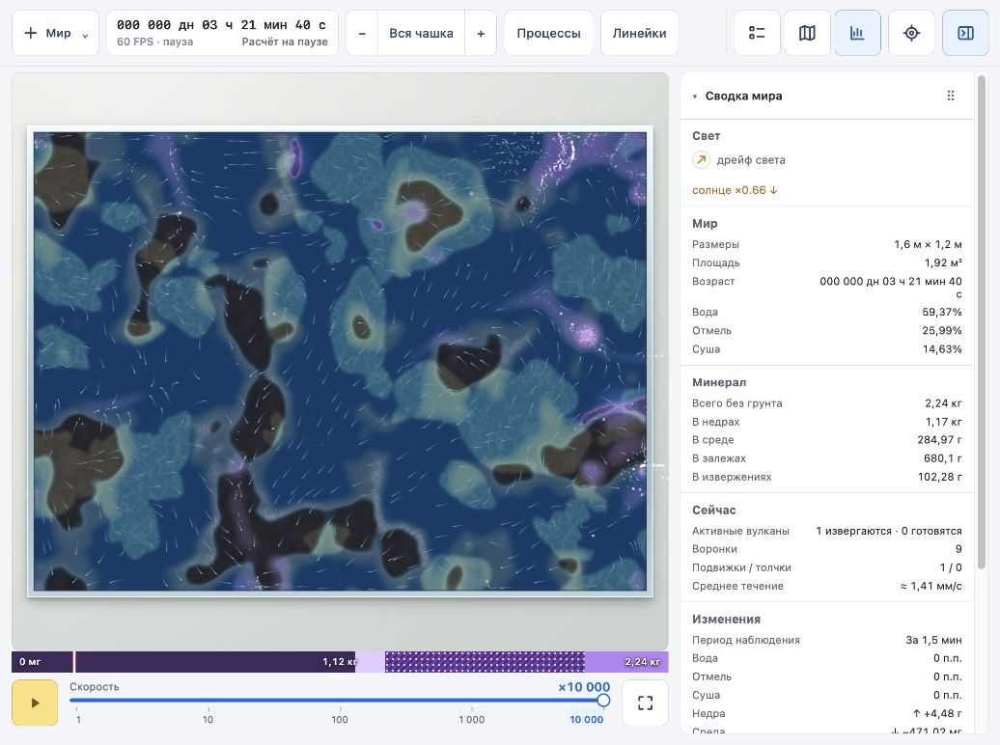
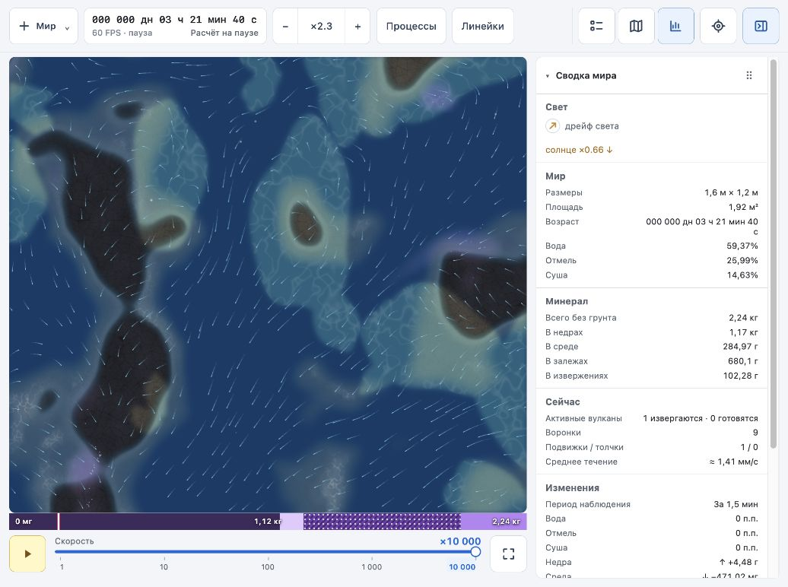

# Первый проход наглядности мира

2026-10-03. Изменения ограничены `world/src/app/render.ts` и документацией.

## Изменения

- Насыщенно-синяя вода заменена более спокойной сине-бирюзовой; мелководье светлее и зеленее. Камень немного светлее и теплее, контраст мелкой фактуры снижен.
- Добавлены две мягкие полосы по существующему уровню среды: светлая подводная полоса и тёмная влажная кромка суши. Они следуют координатам мира и сохраняются при приближении.
- Залежи получили мелкую неподвижную фактуру; в глубокой воде богатые скопления слегка просвечивают. Береговые полосы ослаблены там, где много залежей, чтобы не перекрашивать минерал.
- Подвижная дымка минерала светлее и немного прозрачнее; насыщение достигается при шести средних плотностях вместо восьми. Дополнительное затемнение дна от мутности снижено с 0,5 до 0,35. Ослабление света минералом сохранено.

Новые холсты, частицы и проходы по всему экрану не добавлены. Берег использует уже прочитанный уровень в существующем проходе построения плиток; фактура залежей — уже вычисляемый хеш. Численная модель и сохранения не менялись.

## Проверка

- `npm run build` прошёл, включая `tsc --noEmit`.
- В браузере просмотрен стартовый прямоугольный мир с сидом 1 и мир на шаге 121 000 (3 ч 21 мин 40 с модельного времени): есть подвижный минерал, залежи, извергающийся вулкан и девять воронок.
- Проверены общий вид и приближение ×2,3. Береговые полосы непрерывны, видимых швов плиток в просмотренной области нет.
- Производительность отдельным сравнительным замером не проверялась. Круглая чашка и другие сиды в этом проходе не проверены.

## Снимки одного состояния

