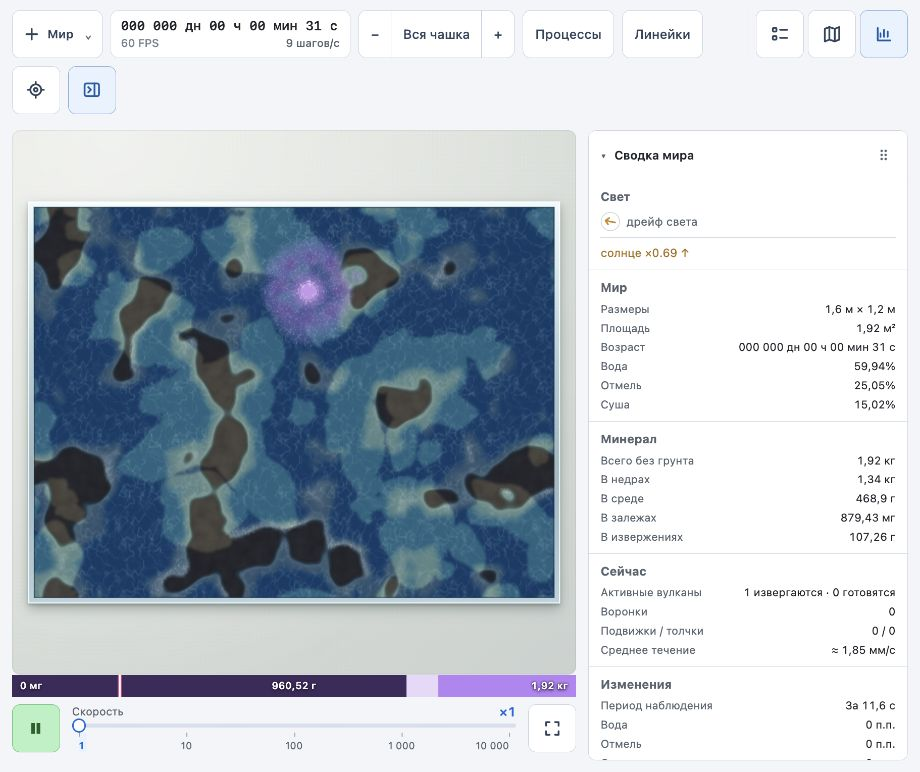

# Импульс вулкана в физическом поле течения

2026-10-03. Изменения только в `world` и `docs`.

## Причина и исправление

Поле среды обновляется каждые 100 шагов, то есть каждые 10 секунд мира. Раньше сила вулкана бралась в одной точке времени посередине этого промежутка. Короткие залпы между такими точками терялись. Кроме того, начало извержения определялось после расчёта течения: первое поступление вещества уже происходило, а соответствующий толчок отсутствовал.

Теперь жизненный цикл источников обновляется перед транспортом, а сила вулкана рассчитывается интегралом профиля залпов и остаточного истечения за весь промежуток. Решения о новом извержении используют давление на начало обновления; поступившее за него вещество влияет на следующее обновление. Существующее поле давления по-прежнему учитывает препятствия и сопротивление среды. Это поле используется и переносом минерала, и визуализацией через `flowAt`; отдельной радиальной силы в шейдере нет.

В тестовом мире с сидом 1 первое извержение начинается на шаге 130. На шаге 200 максимальная скорость от вулкана раньше была нулевой; после исправления она составляет 9,23 мм за шаг (около 92 мм/с). Следующий интервал даёт 7,32 мм за шаг. Это локальные максимумы компонента течения от вулкана, а не средняя скорость всей чашки.

Шейдер получает карту по размеру физической ячейки, с пределом 128 × 128 точек. Каждый компонент скорости кодируется двумя байтами вместо одного, чтобы сильный выброс не обнулял слабое соседнее течение. Маска воды применяется по местности при композиции. Растр эффекта ограничен 1024 пикселями по длинной стороне; карта обновляется не чаще 10 раз в секунду, кроме смены камеры.

Длительность и профиль извержения не изменены. Увеличение длительности при сохранении объёма продлевает воздействие, но уменьшает его среднюю мощность. Существующий расчёт усредняет силу за 10 секунд и не добавляет распространение инерционной волны. Фазовое смешивание текстуры показывает текущее поле приближённо, а не хранит траектории материала.

## Проверка

- `node --experimental-strip-types scripts/check-volcano-flow.mjs`: прямоугольная и круглая чашка; первый толчок, соответствие интегральной силе, полный импульс, короткие залпы, отсутствие силы вне извержения, непроницаемые клетки, конечность значений, сохранение массы и продолжение после загрузки. На шаге 5250 ошибки массы — −6,71·10⁻⁸ и −7,45·10⁻⁹ в единицах модели; хеши продолжения совпадают.
- `npm run build`: TypeScript и production-сборка проходят. `git diff --check` без ошибок.
- В браузере загружено состояние первого извержения на шаге 200. Проверены пауза и движение на ×1 до шага 318. Атрибут `data-flow-renderer` подтверждает `webgl`, журнал ошибок и предупреждений пуст. Рисунок ряби меняется вокруг действующего источника. Индикатор показывает 60 FPS и 10 шагов/с; это наблюдение сеанса, а не сравнительный замер производительности.
- При проверке найдена и исправлена ошибка GLSL: имя `packed` зарезервировано и вызывало переход на Canvas 2D. Ошибки инициализации WebGL теперь сопровождаются предупреждением с причиной.

